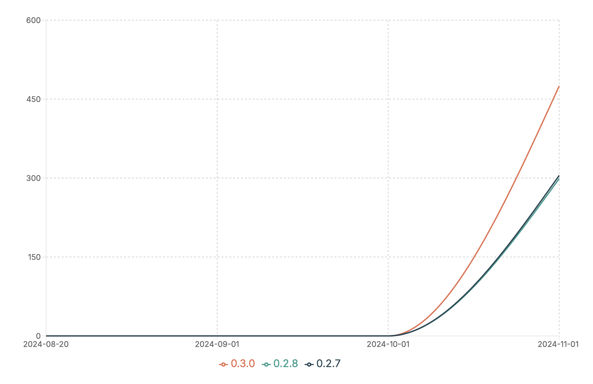

[](https://pepy.tech/project/corerec)


<div align="center">
    
    <h1>CoreRec & VishGraphs Manual</h1>
</div>

Discover the power of graph analysis and recommendation with CoreRec & VishGraphs. Dive into our comprehensive manual and explore the endless possibilities.

<h2>
    
    Introduction
</h2>

CoreRec is your all-in-one recommendation engine for graph-based algorithms. Seamlessly integrating advanced neural network architectures, CoreRec excels in node recommendations, model training, and graph visualizations, making it the ultimate tool for data scientists and researchers.
VishGraphs is your ultimate Python library for graph visualization and analysis. Whether you're a data scientist, researcher, or hobbyist, VishGraphs offers intuitive tools to generate, visualize, and analyze graphs effortlessly.

### Our Downloads per month


> **Note:**
> last updated: 2024-11-20
<h2>
    
    Features
</h2>


#### core_rec.py

- **`GraphTransformer(num_layers, d_model, num_heads, d_feedforward, input_dim)`**
  - A Transformer model for graph data with customizable parameters.
  
- **`GraphDataset(adj_matrix)`**
  - A PyTorch dataset for graph data, streamlining model training.
  
- **`train_model(model, data_loader, criterion=False, optimizer=False, num_epochs=False)`**
  - Train your model with ease using our flexible training function.
  
- **`predict(model, graph, node_index, top_k=5)`**
  - Predict similar nodes with precision using trained models.
  
- **`aaj_accuracy(graph, node_index, recommended_indices)`**
  - Measure the accuracy of your recommendations with our robust metrics.

#### vish_graphs.py

- **`generate_large_random_graph(num_people, file_path="large_random_graph.csv", seed=None)`**
  - Generate and save large random graphs effortlessly.
  
- **`draw_graph(adj_matrix, top_nodes=None, recommended_nodes=None, node_labels=None, transparent_labeled=True, edge_weights=None)`**
  - Create stunning 2D visualizations of your graphs.
  
- **`draw_graph_3d(adj_matrix, top_nodes=None, recommended_nodes=None, node_labels=None, transparent_labeled=True, edge_weights=None)`**
  - Experience your graphs in 3D with customizable features.
  
- **`show_bipartite_relationship(adj_matrix)`**
  - Visualize bipartite relationships with clarity.

<h2>
    
    Installation
</h2>

Install sspipe using pip:
```bash
pip install --upgrade corerec
```
Then import it in your scripts.

```python
import engine.core_rec as cr
import engine.vish_graphs as vg
```
### Optimizers / Boosters
In case you wanna use optimizers from corerec.
Eg:

```python
from engine.cr_boosters.adam import Adam
```
CoreRec has Various in-built optimizers for training models.

#### Available Optimizers for the reco :
 

- **Adam**
- **Nadam**
- **Adamax**
- **Adadelta**
- **Adagrad**
- **ASGD**
- **LBFGS**
- **RMSprop**
- **SGD**
- **SparseAdam**


<h2>
    
    CoreRec Manual
</h2>

<h3>
    
    Table of Contents
</h3>

1. [Introduction](#introduction)
2. [Installation](#installation)
3. [Usage](#usage)
    - [Generating Random Graphs](#generating-random-graphs)
    - [Drawing Graphs](#drawing-graphs)
4. [Directory Structure](#directory-structure)
5. [Troubleshooting](#troubleshooting)
6. [Contributing](#contributing)
7. [License](#license)

# Introduction
- CoreRec:
CoreRec is a cutting-edge recommendation engine for graph data analysis and visualization. It excels in recommending similar nodes, training machine learning models, and visualizing complex network structures.
- VishGraphs:
VishGraphs is a Python library designed for graph visualization and analysis. It offers tools for generating random graphs, drawing graphs in 2D and 3D, and analyzing graph properties.

<h3>
    
    Directory Structure
</h3>

<table>
<thead>
<tr>
<th>Description</th>
<th>Quick Access</th>
</tr>
</thead>
<tbody>

<tr><td><h3>CoreRec</h3>
Core recommendation engine components and utilities
</td><td><pre>

CoreRec/
├── corerec/              
│   ├── engines/         
│   │   ├── contentFilterEngine/
│   │   ├── unionizedFilterEngine/
│   │   └── test_struct_UF/
│   ├── preprocessing/   
│   ├── torch_nn/       
│   └── config/         
│
├── examples/            
│   ├── Youtube_MoE/    
│   └── ContentFilterExamples/  
│
├── documentation/       
│   └── _build/
│
├── datasets/          
│
├── src/                
│   ├── CoreRec/
│   ├── SANDBOX/
│   └── USECASES/
│
├── tests/             
│
├── vish_graphs/       
│
└── roadmap/             

</pre></td></tr>

<tr><td><h3>Engines</h3>
Engines Parts and Algorithms it Supports
</td><td><pre>
engines/
├── __init__.py
├── content_based.py
├── hybrid.py
│
├── contentFilterEngine/
│   ├── __init__.py
│   ├── base_recommender.py
│   ├── cr_contentFilterFactory.py
│   ├── tfidf_recommender.py
│   │
│   ├── traditional_ml_algorithms/
│   │   ├── LR.py
│   │   ├── decision_tree.py
│   │   ├── lightgbm.py
│   │   ├── svm.py
│   │   ├── tfidf.py
│   │   └── vw.py
│   │
│   ├── nn_based_algorithms/
│   │   ├── AITM.py
│   │   ├── DSSM.py
│   │   ├── MIND.py
│   │   ├── TDM.py
│   │   ├── WidenDeep.py
│   │   ├── Word2Vec.py
│   │   ├── Youtube_dnn.py
│   │   ├── autoencoder.py
│   │   ├── cnn.py
│   │   ├── dkn.py
│   │   ├── lstur.py
│   │   ├── naml.py
│   │   ├── npa.py
│   │   ├── nrms.py
│   │   ├── rnn.py
│   │   ├── transformer.py
│   │   └── vae.py
│   │
│   ├── context_personalization/
│   │   ├── context_aware.py
│   │   ├── item_profiling.py
│   │   └── user_profiling.py
│   │
│   ├── fairness_explainability/
│   │   ├── explainable.py
│   │   ├── fairness_aware.py
│   │   └── privacy_preserving.py
│   │
│   └── [Other specialized modules...]
│
├── unionizedFilterEngine/
│   ├── __init__.py
│   ├── als_recommender.py
│   ├── base_recommender.py
│   ├── cr_unionizedFactory.py
│   ├── initializer.py
│   ├── matrix_factorization.py
│   │
│   ├── nn_base/
│   │   ├── AFM_base.py
│   │   ├── AutoFI_base.py
│   │   ├── DCN_base.py
│   │   ├── DIEN_base.py
│   │   ├── DIN_base.py
│   │   ├── DeepFM_base.py
│   │   ├── NFM_base.py
│   │   └── [Other neural network models...]
│   │
│   ├── graph_based_base/
│   │   ├── DeepWalk_base.py
│   │   ├── GNN_base.py
│   │   ├── lightgcn_base.py
│   │   └── [Other graph-based models...]
│   │
│   ├── mf_base/
│   │   ├── ALS_base.py
│   │   ├── SVD_base.py
│   │   ├── nmf_base.py
│   │   └── [Other matrix factorization models...]
│   │
│   └── attention_mechanism_base/
│       ├── Attention_based_uf_base.py
│       ├── SASRec_base.py
│       └── Transformer_based_uf_base.py
│
└── test_struct_UF/
    ├── factory/
    ├── matrix_factorization_algorithms/
    ├── neural_network_based_algorithms/
    ├── graph_based_algorithms/
    └── attention_mechanism_based_algorithms/
         

</pre></td></tr>


</tbody>
</table>


# Usage
### Generating Random Graphs
Generate random graphs effortlessly with the `generate_random_graph` function:

```python
import vish_graphs as vg
graph_file = vg.generate_random_graph(10, "random_graph.csv")
```

# The use cases are:-
## 🔍 Delve into Advanced Graph Analysis and Recommendation with VishGraphs and CoreRec! 🚀
Welcome to a world of cutting-edge graph analysis and recommendation tools brought to you by VishGraphs and CoreRec. Uncover the potential of data visualization and machine learning in a sophisticated manner.

[🔗 Explore Detailed UseCases Here 🔗](https://github.com/vishesh9131/CoreRec/blob/main/src/USECASES/usecases.md)

## CoreRec

```python
import core_rec as cs
```

### 1. `GraphTransformer(num_layers, d_model, num_heads, d_feedforward, input_dim)`

Main Algorithm CoreRec Provides Based on Transformer Architecture works fine with PyTorch, CoreRec etc. In Simple terms it uses **DNG Score** to rank prediction of surrondings of Target node Providing a Enhanced way to compute **Attention**.

**Use case:** Providing recommendations for nodes based on their similarity within a graph.

### 2. `GraphTransformerV2(num_layers, d_model, num_heads, d_feedforward, input_dim)`

GraphTransformerV2 adds dropout and layer normalization, enhancing robustness compared to GraphTransformer's simpler architecture.

**Use case:** More Evolved Training machine learning models for graph-related tasks, such as node classification or link prediction.

### 3. `GraphDataset(adj_matrix, weight_matrix)`

Defines a PyTorch dataset for graph data, allowing easy integration with DataLoader for model training.

**Use case:** Preparing graph data for training machine learning models.

### 4. `train_model(model, data_loader, criterion, optimizer, num_epochs)`

Trains a given model using the provided data loader, loss function, optimizer, and number of epochs.

**Use case:** Training machine learning models for graph-related tasks using graph data.

In the `test.py` file, various functionalities from `vish_graphs.py` and `core_rec.py` are utilized and demonstrated:
- Random graph generation (`generate_random_graph`).
- Identification of top nodes in a graph (`find_top_nodes`).
- Training a Transformer model for graph data (`GraphTransformerV2`, `GraphDataset`, `train_model`).
- Recommending similar nodes using a trained model (`recommend_similar_nodes`).
- Visualization of a graph in 3D (`draw_graph_3d`).

## vishgraphs

```python
import vishgraphs as vg
```
### 1. `generate_random_graph(num_people, file_path="graph_dataset.csv", seed=None)`

Generate a random graph with a specified number of people and save the adjacency matrix to a CSV file.

**Use case:** Generating synthetic graph data for testing algorithms or simulations.

### 2. `draw_graph(adj_matrix, nodes, top_nodes)`

Draw a 2D visualization of a graph based on its adjacency matrix, highlighting top nodes if specified.

**Use case:** Visualizing relationships within a graph dataset.

### 3. `find_top_nodes(matrix, num_nodes=10)`

Identify the top nodes with the greatest number of strong correlations in a graph.

**Use case:** Identifying influential or highly connected nodes in a network.

### 4. `draw_graph_3d(adj_matrix, nodes, top_nodes)`

Create a 3D visualization of a graph based on its adjacency matrix, with optional highlighting of top nodes.

**Use case:** Visualizing complex network structures in a three-dimensional space.

### 5. `show_bipartite_relationship_with_cosine(adj_matrix)`

Visualize bipartite relationships in a graph using cosine similarity and community detection algorithms.

**Use case:** Analyzing relationships between different sets of nodes in a bipartite graph.

### 6. `bipartite_matrix_maker(csv_path)`

Read a CSV file containing a bipartite adjacency matrix and return it as a list.

**Use case:** Preparing data for analyzing bipartite networks.

---

Explore the codebase and utilize these functionalities for your graph analysis and recommendation tasks! If you have any questions or need further assistance, don't hesitate to reach out. Happy graph analyzing! 📊🔍

### Drawing Graphs
VishGraphs supports drawing graphs in both 2D and 3D:

```python
adj_matrix = vishgraphs.bipartite_matrix_maker(graph_file)
nodes = list(range(len(adj_matrix)))
top_nodes = [0, 1, 2] # Example top nodes
vishgraphs.draw_graph(adj_matrix, nodes, top_nodes)
```


## Core Team 👨‍💻

These are the humans that form the CoreRec's core team, which runs the project.
(Team is not yet decided)
<!-- In alphabetical order: -->

| [@vishesh9131][vishesh9131-user] | 
| :---: | 
| [![][vishesh9131-img]][vishesh9131-user] | 
| **Founder / Creator** | 

[vishesh9131-img]:https://avatars.githubusercontent.com/u/87526302?s=96&v=4

[vishesh9131-user]: https://github.com/vishesh9131

---

<h3>
    
    Troubleshooting
</h3>

### Troubleshooting Guide

For issues with CoreRec and VishGraphs:

1. **Check Documentation:** Ensure you're following the library's guidelines and examples correctly.
2. **GitHub Issues:** Report bugs or seek help by creating an issue on the GitHub repository.
3. **Verify Data:** Confirm that your input data is correctly formatted and compatible.
4. **Model Parameters:** Double-check model configurations and training parameters.
5. **Visualization Inputs:** Ensure correct parameters for graph visualization functions.
6. **Community Help:** Utilize community forums for additional support.

This streamlined approach should help resolve common issues efficiently.

<h3>
    
    Contributing
</h3>

We welcome contributions to enhance the functionalities of our graph analysis and recommendation tools. If you're interested in contributing, here are a few ways you can help:

- **Bug Fixes:** Identify and fix bugs in the existing code.
- **Feature Enhancements:** Suggest and implement improvements to current features.
- **New Features:** Propose and develop new features that could benefit users of the libraries.
- **Documentation:** Help improve the documentation to make the libraries more user-friendly.

### To contribute, please follow these steps:
1. Fork the repository.
2. Create a new branch for your feature or fix.
3. Develop your changes while adhering to the coding standards and guidelines.
4. Submit a pull request with a clear description of the changes and any relevant issue numbers.

Your contributions are greatly appreciated and will help make these tools more effective and accessible to everyone!

<h3>
    
    License
</h3>
VishGraphs is distributed under the following terms:

>The library and utilities are only for research purposes. Please do not use it commercially without the author's (@Vishesh9131) consent.

## Examples and Demos

- **Dataset note (crlearn)**: Examples will try to use the IJCAI dataset via `cr_learn.ijcai.load()` when available. If not available, they fall back to CSVs in `sample_data/`. You don't need to change the scripts; they auto-detect.

- **Deep engines (tiny, runnable demos)**

```bash
# Deep & Cross Network
python examples/engines_dcn_example.py

# DeepFM
python examples/engines_deepfm_example.py

# GNN-based recommender
python examples/engines_gnnrec_example.py

# MIND (multi-interest) sequential recommender
python examples/engines_mind_example.py

# NASRec
python examples/engines_nasrec_example.py

# SASRec (self-attentive sequential)
python examples/engines_sasrec_example.py
```

- **UnionizedFilterEngine (collaborative/hybrid)**

```bash
# FastAI-style embedding dot-bias
python examples/unionized_fast_example.py

# FastAI-style recommender variant
python examples/unionized_fast_recommender_example.py

# SAR (item-to-item similarity)
python examples/unionized_sar_example.py

# RLRMC (Riemannian low-rank)
python examples/unionized_rlrmc_example.py

# RBM (Restricted Boltzmann Machine)
python examples/unionized_rbm_example.py

# GeoMLC (geometric matrix completion)
python examples/unionized_geomlc_example.py
```

- **Content Filter**

```bash
# TF-IDF based content filter
python examples/content_filter_tfidf_example.py
```

- **Frontends (imshow plug-and-play)**

```bash
# Minimal plug-and-play frontend server
python examples/imshow_connector_example.py
# Then open http://127.0.0.1:8000 in your browser
```

- **Unified Test Runner**

```bash
# Discover and run the test suite with a compact report
python examples/run_all_algo_tests_example.py
```

Tips
- All example scripts add the project root to `sys.path` automatically so you can run them directly.
- If `cr_learn` is installed, examples will prefer it; otherwise they use `sample_data/` CSVs bundled in this repo.
