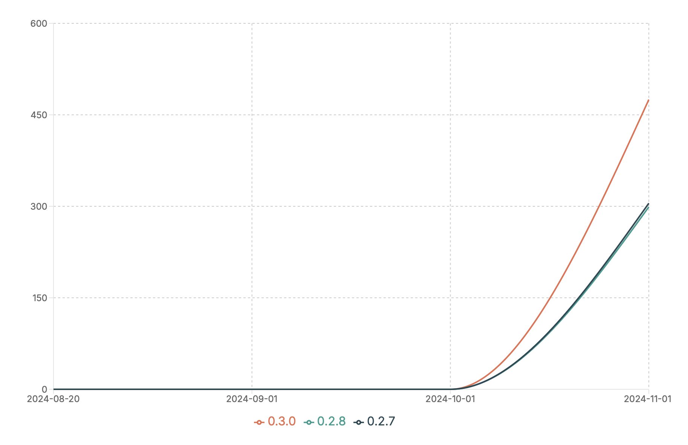

[](https://pepy.tech/project/corerec)
[](https://github.com/vishesh9131/CoreRec/commits)
[](https://libraries.io/github/vishesh9131/corerec)
[](https://libraries.io/pypi/corerec)
[](https://github.com/vishesh9131/CoreRec)
[](https://github.com/vishesh9131/CoreRec)

<div align="center">
  <br/>
  <h1>CoreRec</h1>
  <p><strong>Production-grade recommendation systems framework.<br/>57+ models · Unified API · Multi-stage pipelines · Research to deployment.</strong></p>
  <br/>
  <code>pip install corerec</code> &nbsp;&nbsp; <code>pip install cr_learn</code>
  <br/><br/>
  <a href="https://corerec.online/docs/">Docs</a> &nbsp;·&nbsp;
  <a href="https://pypi.org/project/corerec/">PyPI</a> &nbsp;·&nbsp;
  <a href="https://github.com/vishesh9131/CoreRec/issues">Issues</a> &nbsp;·&nbsp;
  <a href="https://github.com/vishesh9131/Core/blob/main/MODERN_RECSYS_GUIDE.md">Modern Guide</a>
</div>

---

## What is CoreRec?

CoreRec is a modern recommendation engine built for the deep learning era. It implements industry-standard architectures — Two-Tower retrieval, Transformers, Graph Neural Networks — following the multi-stage pipeline approach used at Netflix, YouTube, and major e-commerce platforms.

- **Unified API**: every model shares `fit`, `predict`, `recommend`, `save`, `load`
- **57+ algorithms**: deep learning, collaborative filtering, graph-based, sequential, Bayesian
- **Multi-stage pipeline**: Retrieval → Ranking → Reranking in a single orchestrated system
- **cr_learn**: companion dataset library for fast prototyping on real-world data

### Downloads per month



> Last updated: 2024-11-20

---

## Installation

```bash
pip install --upgrade corerec
pip install cr_learn          # dataset companion (optional but recommended)
```

### Requirements
- Python ≥ 3.8
- PyTorch ≥ 1.9
- NumPy, Pandas, SciPy

---

## Quickstart in 60 seconds

```python
from corerec.engines import DCN
from cr_learn import ml_1m

# 1. Load a real dataset (auto-downloads MovieLens 1M)
data = ml_1m.load()
ratings = data['ratings']

user_ids = ratings['user_id'].values
item_ids = ratings['movie_id'].values
r        = ratings['rating'].values

# 2. Train
model = DCN(embedding_dim=64, epochs=10, verbose=True)
model.fit(user_ids=user_ids, item_ids=item_ids, ratings=r)

# 3. Recommend
recs = model.recommend(user_id=1, top_k=10)
print(recs)
```

That's it. The same three lines — `fit`, `recommend`, `predict` — work for every model in CoreRec.

---

## Core API

Every model in CoreRec inherits from `BaseRecommender` and exposes the same interface:

```python
model.fit(user_ids, item_ids, ratings)          # train
model.predict(user_id, item_id)                 # → float score
model.recommend(user_id, top_k=10)              # → list of item IDs
model.batch_predict([(uid, iid), ...])          # → list of floats
model.save('model.pkl')                         # persist
model = ModelClass.load('model.pkl')            # restore
```

---

## Model Families

###  Deep Learning (29 models)

Best for feature-rich data with complex interaction patterns.

| Model | Description | Import |
|-------|-------------|--------|
| **DCN** | Deep & Cross Network — explicit + implicit feature crossing | `from corerec.engines import DCN` |
| **DeepFM** | Factorization Machines + Deep Network | `from corerec.engines import DeepFM` |
| **GNNRec** | Graph Neural Network recommender | `from corerec.engines import GNNRec` |
| **MIND** | Multi-Interest sequential network | `from corerec.engines import MIND` |
| **SASRec** | Self-Attentive Sequential Recommendation | `from corerec.engines import SASRec` |
| **NASRec** | Neural Architecture Search for RecSys | `from corerec.engines import NASRec` |
| **BERT4Rec** | Bidirectional Transformer for sequences | `from corerec.engines.content_based import BERT4Rec` |
| **TwoTower** | Dual-encoder retrieval (YouTube-style) | `from corerec.engines import TwoTower` |
| AFM, AutoInt, DIN, DIEN, DLRM, PNN, NCF, NFM, FIBINet, xDeepFM, Wide&Deep, YouTubeDNN, ESMM, MMoE, PLE, FGCNN, Monolith … | | see `corerec.engines` |

#### DCN example

```python
from corerec.engines import DCN
from cr_learn import ml_1m

data = ml_1m.load()
ratings = data['ratings']

model = DCN(
    embedding_dim=64,
    num_cross_layers=3,
    deep_layers=[128, 64],
    epochs=20,
    learning_rate=0.001,
    verbose=True,
)
model.fit(
    user_ids=ratings['user_id'].values,
    item_ids=ratings['movie_id'].values,
    ratings=ratings['rating'].values,
)

score = model.predict(user_id=1, item_id=100)
recs  = model.recommend(user_id=1, top_k=10)
print(f"Score: {score:.3f}  |  Top-10: {recs}")
```

#### TwoTower (retrieval at scale)

```python
from corerec.engines import TwoTower

model = TwoTower(user_input_dim=64, item_input_dim=128, embedding_dim=256)
model.fit(user_ids, item_ids, interactions)

candidates = model.recommend(user_id=42, top_k=100)
```

#### Sequential / transformer

```python
from corerec.engines.content_based import BERT4Rec

model = BERT4Rec(hidden_dim=256, num_layers=4)
model.fit(user_ids, item_ids, interactions)
next_items = model.recommend(user_id=1, top_k=10)
```

---

### Collaborative Filtering

Simple Algorithm for Recommendation (SAR) — fast, no GPU required.

```python
from corerec.engines.collaborative import SAR
import pandas as pd

df = pd.DataFrame({
    'userID': [0, 0, 1, 1, 2],
    'itemID': [10, 20, 10, 30, 20],
    'rating': [5.0, 4.0, 5.0, 3.0, 4.0],
})

model = SAR(similarity_type='jaccard')   # also: 'cosine', 'lift', 'cooccurrence'
model.fit(df)

recs = model.recommend(user_id=0, top_k=5)
batch_recs = model.recommend_k_items(df[['userID']], top_k=10)  # all users at once
```

---

### Content-Based Filtering

```python
from corerec.engines.content_based import TFIDFRecommender

items = [101, 102, 103]
docs  = {101: "action adventure film", 102: "romantic comedy", 103: "thriller suspense"}

model = TFIDFRecommender()
model.fit(items=items, docs=docs)

recs  = model.recommend_by_text(query_text="action thriller", top_n=5)
```

---

### Graph-Based

```python
from corerec.engines import GNNRec

model = GNNRec(embedding_dim=64, epochs=20)
model.fit(user_ids, item_ids, ratings)
recs = model.recommend(user_id=1, top_k=10)
```

---

### Multi-Modal Fusion

```python
from corerec.multimodal.fusion_strategies import MultiModalFusion

fusion = MultiModalFusion(
    modality_dims={'text': 768, 'image': 2048, 'meta': 32},
    output_dim=256,
    strategy='attention',
)
item_embedding = fusion({'text': text_emb, 'image': img_emb, 'meta': meta})
```

---

## Multi-Stage Pipeline

Production systems use Retrieval → Ranking → Reranking. CoreRec ships this pattern out of the box:

```python
from corerec.pipelines import RecommendationPipeline, PipelineConfig

pipeline = RecommendationPipeline(
    config=PipelineConfig(retrieval_k=200, ranking_k=50, final_k=10)
)
pipeline.add_retriever(my_retriever, weight=1.0)
pipeline.set_ranker(my_ranker)
pipeline.add_reranker(diversity_reranker)

result = pipeline.recommend(user_id=123, top_k=10)
```

---

## cr_learn — Dataset Library

`cr_learn` is CoreRec's companion package. It provides one-line access to real recommendation datasets, auto-downloading and caching them locally.

```bash
pip install cr_learn
```

### Available datasets

| Dataset | Module | Load |
|---------|--------|------|
| MovieLens 1M | `cr_learn.ml_1m` | `ml_1m.load()` |
| IJCAI-16 (Tmall/O2O) | `cr_learn.ijcai` | `ijcai.load()` |
| Tmall | `cr_learn.tmall` | `tmall.load()` |
| Steam Games | `cr_learn.steam_games` | `steam_games.load()` |
| BeiDou/BeiBei | `cr_learn.beibei` | `beibei.load()` |
| LibraryThing | `cr_learn.library_thing` | `library_thing.load()` |
| Rees46 | `cr_learn.rees46` | `rees46.load()` |

### Example: MovieLens 1M

```python
from cr_learn import ml_1m

data = ml_1m.load()
# Returns dict with keys: 'users', 'ratings', 'movies',
#                         'user_interactions', 'item_features', 'trn_buy'

print(data['ratings'].head())
#    user_id  movie_id  rating  timestamp
# 0        1      1193     5.0  978300760
# ...

# Ready-to-use training data
ratings = data['ratings']
user_ids = ratings['user_id'].values
item_ids = ratings['movie_id'].values
r        = ratings['rating'].values
```

### Example: IJCAI-16 (O2O commerce)

```python
from cr_learn import ijcai

data = ijcai.load(limit_rows=50000)
# Returns dict with train/test DataFrames + user/item features
```

### Datasets auto-detect in examples

All example scripts try `cr_learn` first and fall back to the bundled `sample_data/` CSVs — no manual setup needed.

---

## Optimizers / Boosters

CoreRec ships its own optimizer suite (compatible with `torch.optim` API):

```python
from corerec.cr_boosters.adam   import Adam
from corerec.cr_boosters.nadam  import NAdam

optimizer = Adam(model.parameters(), lr=0.001)
```

Available: **Adam · NAdam · Adamax · Adadelta · Adagrad · ASGD · LBFGS · RMSprop · SGD · SparseAdam**

---

## Runnable Examples

### Deep Learning Engines

```bash
python examples/engines_dcn_example.py        # Deep & Cross Network
python examples/engines_deepfm_example.py     # DeepFM
python examples/engines_gnnrec_example.py     # GNN-based recommender
python examples/engines_mind_example.py       # MIND (multi-interest)
python examples/engines_nasrec_example.py     # NASRec
python examples/engines_sasrec_example.py     # SASRec (self-attentive)
```

### Collaborative / Hybrid

```bash
python examples/unionized_sar_example.py      # SAR (item-to-item similarity)
python examples/unionized_fast_example.py     # FastAI-style embedding
python examples/unionized_rbm_example.py      # Restricted Boltzmann Machine
python examples/unionized_rlrmc_example.py    # Riemannian low-rank matrix completion
python examples/unionized_geomlc_example.py   # Geometric matrix completion
```

### Content Filter

```bash
python examples/content_filter_tfidf_example.py   # TF-IDF content filter
```

### Frontends (imshow)

```bash
python examples/imshow_connector_example.py   # plug-and-play demo UI
# Then open http://127.0.0.1:8000
```

### Full Test Suite

```bash
python examples/run_all_algo_tests_example.py  # discover + run all algorithm tests
```

> **Tip**: All scripts add the project root to `sys.path` automatically. If `cr_learn` is installed, they prefer it; otherwise they use `sample_data/` CSVs bundled in this repo.

---

## Project Structure

<table>
<thead><tr><th>Area</th><th>Path</th></tr></thead>
<tbody>
<tr><td><strong>Core models</strong></td><td><pre>
corerec/
├── engines/
│   ├── dcn.py, deepfm.py, gnnrec.py, mind.py,
│   │   sasrec.py, nasrec.py, bert4rec.py, two_tower.py
│   ├── collaborative/       SAR, LightGCN, NCF, TwoTower
│   └── content_based/       TFIDFRecommender, YoutubeDNN, DSSM
├── pipelines/               RecommendationPipeline, DataPipeline
├── retrieval/               Candidate retrieval, ensemble fusion
├── ranking/                 Pointwise, pairwise, feature-cross rankers
├── reranking/               Diversity, fairness rerankers
├── multimodal/              MultiModalFusion, encoders
├── embeddings/              Pretrained embeddings, tables
├── evaluation/              Evaluator, metrics (RMSE, NDCG, MAP …)
├── explanation/             Feature-based & generative explainers
├── serving/                 ModelServer, batch inference
├── api/                     BaseRecommender, exceptions, mixins
└── cr_boosters/             Adam, NAdam, SGD, … optimizers
</pre></td></tr>
<tr><td><strong>Datasets</strong></td><td><pre>
cr_learn_setup/cr_learn/
├── ml_1m.py       MovieLens 1M
├── ijcai.py       IJCAI-16 O2O
├── tmall.py       Tmall
├── beibei.py      BeiBei
├── steam_games.py Steam Games
├── rees46.py      Rees46
└── library_thing.py
</pre></td></tr>
<tr><td><strong>Docs & Examples</strong></td><td><pre>
docs/source/
├── tutorials/     57 model tutorials (DCN, DeepFM, SASRec …)
├── api/           Full API reference
├── user_guide/    Data prep, training, persistence, best practices
└── examples/      Basic, advanced, production deployment

examples/          Runnable .py scripts for every engine
</pre></td></tr>
</tbody>
</table>

---

## VishGraphs

CoreRec ships with **VishGraphs**, a companion library for graph visualization and analysis:

```python
import vish_graphs as vg

# Generate a random graph and save to CSV
graph_file = vg.generate_random_graph(num_people=100, file_path="graph.csv")

# Load as adjacency matrix and visualize
adj_matrix = vg.bipartite_matrix_maker(graph_file)
nodes      = list(range(len(adj_matrix)))
top_nodes  = [0, 1, 2]

vg.draw_graph(adj_matrix, nodes, top_nodes)         # 2D
vg.draw_graph_3d(adj_matrix, nodes, top_nodes)      # 3D
vg.show_bipartite_relationship(adj_matrix)          # bipartite view
```

**API summary:**

| Function | Description |
|----------|-------------|
| `generate_random_graph(n, file_path, seed)` | Generate & save random adjacency matrix |
| `draw_graph(adj, top_nodes, recommended_nodes, ...)` | 2D graph visualization |
| `draw_graph_3d(adj, top_nodes, ...)` | 3D graph visualization |
| `show_bipartite_relationship(adj)` | Bipartite relationship view |
| `find_top_nodes(matrix, num_nodes)` | Most-connected nodes |
| `bipartite_matrix_maker(csv_path)` | Load adjacency matrix from CSV |

---

## Documentation

Full documentation is available at **[vishesh9131.github.io/CoreRec](https://vishesh9131.github.io/CoreRec/)**.

Build locally:

```bash
pip install sphinx sphinx-design myst-parser sphinx-book-theme
sphinx-build -b html docs/source docs/build/html
open docs/build/html/index.html
```

**Key sections:**
- [Installation](https://vishesh9131.github.io/CoreRec/installation.html)
- [QuickStart](https://vishesh9131.github.io/CoreRec/quickstart.html)
- [57 Model Tutorials](https://vishesh9131.github.io/CoreRec/tutorials/index.html)
- [API Reference](https://vishesh9131.github.io/CoreRec/api/engines.html)
- [Production Deployment](https://vishesh9131.github.io/CoreRec/examples/production_deployment.html)

---

## Troubleshooting

<details>
<summary><strong>ImportError / module not found</strong></summary>

```bash
pip install --upgrade corerec
```
</details>

<details>
<summary><strong>NumPy 2.x conflict with PyTorch</strong></summary>

```bash
pip install "numpy<2"
```
</details>

<details>
<summary><strong>CUDA / GPU issues</strong></summary>

```bash
pip install torch torchvision torchaudio --extra-index-url https://download.pytorch.org/whl/cu118
```
</details>

<details>
<summary><strong>cr_learn dataset download fails</strong></summary>

Examples fall back to `sample_data/` CSVs bundled in this repo automatically. No action needed.
</details>

For anything else: [open an issue](https://github.com/vishesh9131/CoreRec/issues) or check the [FAQ](https://vishesh9131.github.io/CoreRec/about/faq.html).

---

## Contributing

We welcome bug fixes, new features, docs improvements, and new models.

1. Fork the repo
2. Create a feature branch (`git checkout -b feature/my-thing`)
3. Make your changes following the existing code style
4. Open a pull request with a clear description

See [CONTRIBUTING.md](https://vishesh9131.github.io/CoreRec/contributing.html) for the full guide.

---

## Core Team

| [@vishesh9131](https://github.com/vishesh9131) |
| :---: |
| [](https://github.com/vishesh9131) |
| **Founder / Creator** |

---

## License

> This library and its utilities are for **research purposes only**. Commercial use requires explicit consent from the author ([@vishesh9131](https://github.com/vishesh9131)).

 See [LICENSE](LICENSE) for details.
