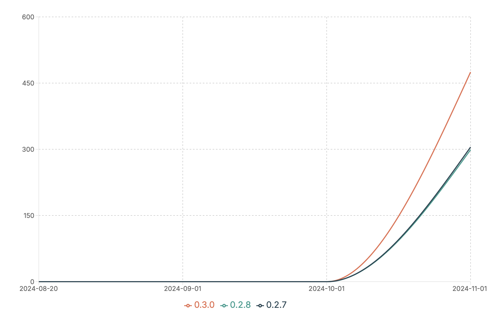

[](https://pepy.tech/project/corerec)
[](https://github.com/vishesh9131/CoreRec/commits)
[](https://libraries.io/github/vishesh9131/corerec)
[](https://libraries.io/pypi/corerec)
[](https://github.com/vishesh9131/CoreRec)
[](https://github.com/vishesh9131/CoreRec)

<div align="center">
  <br/>
  <h1>CoreRec</h1>
  <p><strong>Recommendation systems framework for PyTorch.<br/>16 models, including generative HSTU · One fit/recommend API · Train to a live HTTP endpoint in one object.</strong></p>
  <br/>
  <code>pip install corerec</code> &nbsp;&nbsp; <code>pip install cr_learn</code>
  <br/><br/>
  <a href="https://corerec.online/docs/">Docs</a> &nbsp;·&nbsp;
  <a href="https://pypi.org/project/corerec/">PyPI</a> &nbsp;·&nbsp;
  <a href="https://github.com/vishesh9131/CoreRec/issues">Issues</a> &nbsp;·&nbsp;
  <a href="https://github.com/vishesh9131/CoreRec/blob/main/MODERN_RECSYS_GUIDE.md">Modern Guide</a>
</div>

<p align="center">
  
</p>

---

## From a CSV to a recommendation API in one command

```bash
pip install "corerec[serving]"
corerec serve events.csv
```

```text
Data      33,406 interactions, 2,000 users, 600 items (user=user_id, item=item_id, rating=rating, timestamp=timestamp)
Model     ALS
Trained   in 5.9s
Holdout   5,897 interactions from 2,000 users
                           NDCG@10  Recall@10
          ALS               0.2172     0.2981
          most popular      0.0988     0.1425
Serving   http://0.0.0.0:8000  (docs at /docs, Ctrl-C to stop)
```

```bash
curl -X POST localhost:8000/recommend -H 'Content-Type: application/json' \
     -d '{"user_id": "u0042", "top_k": 5}'
# {"user_id":"u0042","recommendations":["i219","i444","i409","i275","i498"],"top_k":5,"source":"model"}
```

That is the whole path. CoreRec finds the user, item, rating and timestamp
columns, holds out each user's most recent interactions, and reports how the
model does on them **next to recommending the most popular items**, the bar any
model has to clear (it warns you when it doesn't). Then it retrains on
everything and serves it. Users it has never seen get the popular items, marked
`"source": "fallback"`, instead of an error.

- `corerec serve events.csv --model EASE` picks a different model; `corerec models` lists all 16. With a timestamp column, sequential models (`--model HSTU`) read each user's history in time order.
- `corerec train events.csv -o artifacts/m` saves the model and its report; `corerec serve artifacts/m` serves it later.
- `docker build -t corerec . && docker run -p 8000:8000 -v "$PWD:/data" corerec /data/events.csv` does the same in a container.
- `corerec.export.to_onnx(model, "model.onnx")` exports TwoTower, DCN, DeepFM or SASRec for ONNX Runtime, so the serving side needs no Python ([guide](docs/source/user_guide/onnx_export.md)).

The output above is real: `sample_data/events.csv` ships with the repo, so
`corerec serve sample_data/events.csv` reproduces it.

> `corerec train` / `corerec serve` need 0.7.0 or later:
> `pip install -U "corerec[serving]"`.

---

## What is CoreRec?

CoreRec is a PyTorch library of recommendation models that share one API, from
fast classic baselines to two-tower retrieval, graph and sequential models, plus
the pieces to evaluate and serve them.

- **Unified API**: every model shares `fit`, `predict`, `recommend`, `save`, `load`
- **16 models**: classic CF (ALS, SAR, ItemKNN, EASE, SLIM), retrieval (TwoTower), graph (LightGCN), ranking (DCN, DeepFM), sequential (SASRec), generative (HSTU), autoencoders (MultVAE) and content (TF-IDF). `corerec models` lists them.
- **Multi-stage pipeline**: Retrieval → Ranking → Reranking in a single orchestrated system
- **cr_learn**: companion dataset library for fast prototyping on real-world data

### Downloads per month



> Chart is a historical snapshot; see [PyPI](https://pypi.org/project/corerec/) for current figures.

---

## Installation

```bash
pip install --upgrade corerec
pip install cr_learn          # dataset companion (optional but recommended)
```

### Requirements
- Python 3.10 to 3.13
- PyTorch ≥ 2.0
- NumPy (1.x or 2.x), pandas, SciPy

The text encoders in `corerec.core.encoders` and `corerec.towers` (used by multimodal
fusion) depend on Hugging Face `transformers`. None of the 16 models need it. Install
the extra to use the encoders:

```bash
pip install "corerec[transformers]"
```

---

## Quickstart in 60 seconds

```python
from corerec.engines import DCN
from cr_learn import ml_1m

# 1. Load a real dataset (auto-downloads MovieLens 1M)
data = ml_1m.load()
ratings = data['ratings']

user_ids = ratings['user_id'].values
item_ids = ratings['movie_id'].values
r        = ratings['rating'].values

# 2. Train
model = DCN(embedding_dim=64, epochs=10, verbose=True)
model.fit(user_ids=user_ids, item_ids=item_ids, ratings=r)

# 3. Recommend
recs = model.recommend(user_id=1, top_k=10)
print(recs)

# 4. Serve it over HTTP   (needs: pip install corerec[serving])
from corerec.serving import ModelServer
ModelServer(model).start()   # POST /recommend on :8000
```

```bash
curl -X POST localhost:8000/recommend \
     -H 'Content-Type: application/json' \
     -d '{"user_id": 1, "top_k": 5}'
```

Training to a live endpoint is one import, and it is the same object either way — no
export step, no separate serving format, no rewrite. `examples/train_and_serve.py` is
that whole path in one runnable file, and `tests/test_train_and_serve.py` runs it on
every commit, so it cannot drift from what this README claims.

The same three calls — `fit`, `recommend`, `predict` — are shared by every model.
`tests/test_model_contract.py` enforces that across the zoo; the one model that
still diverges (`SAR` takes a DataFrame, with `fit_from_lists` as its
triple-shaped entry point) is listed there explicitly rather than left for you to
discover.

---

## How it compares

Measured against [`implicit`](https://github.com/benfred/implicit) on MovieLens-100K,
same split, same budget (`RANK_DIM=32`, `EPOCHS=20`), CPU only. Full method,
caveats and raw JSON in **[BENCHMARKS.md](BENCHMARKS.md)**.

| Model | NDCG@10 | Fit (s) | |
|---|---:|---:|---|
| **corerec ALS** | **0.4168** | 5.13 | beats implicit's ALS on quality |
| implicit ALS | 0.4100 | 0.56 | ~9x faster to fit |
| **corerec SAR (cosine)** | **0.3955** | 0.35 | beats implicit's cosine ItemKNN |
| implicit ItemKNN | 0.3858 | 0.08 | |

CoreRec wins the like-for-like model comparisons and **loses on speed by roughly
9x** — implicit is years of tuned Cython over BLAS, and on data 100x this size
that ratio is the deciding factor. Fusing two models with reciprocal rank fusion,
implicit's ensemble still edges CoreRec's (0.4547 vs 0.4493).

### At million-interaction scale

On the two standard graph benchmarks, CoreRec's LightGCN (the native trainer
behind `corerec.serving.OnlineRecommender`) ranks first against `implicit`,
LightFM and Cornac. It is also the slowest model in the table to train, and on
the denser MovieLens-1M it comes third. Single runs; raw JSON in
[`Findings/bench/results/`](Findings/bench/results/).

| Dataset | Interactions | CoreRec LightGCN NDCG@20 | Best other library | Fit time (CoreRec vs best other) |
|---|---:|---:|---|---:|
| Gowalla | ~1.0M | **0.1451** | 0.1171 (LightFM WARP) | 335s vs 23s |
| Yelp2018 | ~1.6M | **0.0460** | 0.0448 (implicit ALS) | 714s vs 10s |
| MovieLens-1M | 1.0M | 0.3115 | **0.3600** (implicit ALS) | 270s vs 1.3s |

Read it as: a clear win on Gowalla (+24%), a tie on Yelp2018 (+2.7% from one
run, inside the seed-to-seed spread measured for LightGCN), and a loss on
MovieLens-1M. RecBole's LightGCN, the strongest reference implementation, is not
in this table yet.

### Generative recommendation: HSTU vs SASRec

`HSTU`, Meta's generative recommender from *Actions Speak Louder than Words*
(ICML 2024), against SASRec on MovieLens-1M with Meta's own recipe and
protocol: each user's latest rating held out, full ranking over all 3,706
items, 100 epochs, scored once at the end. Our two rows differ only in the
architecture.

| Model | NDCG@10 | HR@10 | Fit (CPU) |
|---|---:|---:|---:|
| **CoreRec HSTU** | **0.1613 ± 0.0028** | **0.2884 ± 0.0059** | 60 min |
| CoreRec SASRec, same recipe | 0.1531 ± 0.0010 | 0.2757 ± 0.0028 | 55 min |
| *Meta HSTU, published* | *0.1720* | *0.3097* | *GPU* |
| *Meta SASRec, published* | *0.1603* | *0.2853* | *GPU* |

Mean ± std over three seeds. HSTU wins on every seed, by +5.3% NDCG@10 on
average rather than the paper's +7.3%, and both of our models land 4-6% below
Meta's numbers. The method, the per-seed results, the known differences from
Meta's setup and the raw JSON are in [BENCHMARKS.md](BENCHMARKS.md).

```python
from corerec.engines import HSTU

model = HSTU(epochs=50).fit(user_ids, item_ids, timestamps=timestamps)
model.recommend(user_id, top_k=10)
```

The benchmark also found seven bugs in CoreRec itself, including a `batch_predict`
that never batched (262ms → 6.8ms per user once fixed) and a graph model (GNNRec,
since removed) that could not finish training on the smallest standard dataset
within an hour. Those are documented rather than omitted.

---

## Core API

Every model in CoreRec inherits from `BaseRecommender` and exposes the same interface:

```python
model.fit(user_ids, item_ids, ratings)          # train
model.predict(user_id, item_id)                 # → float score
model.recommend(user_id, top_k=10)              # → list of item IDs
model.batch_predict([(uid, iid), ...])          # → list of floats
model.save('artifacts/my_model')                # persist (safe bundle: base path, no extension)
model = ModelClass.load('artifacts/my_model')   # restore
```

> **Persistence note**: `save` writes a *safe bundle* — pass a base path (not a `.pkl`
> file). It produces `<base>.meta.json` + `<base>.weights.pt`; `load` takes the same base
> path. See [Safe Bundle Persistence](docs/source/user_guide/safe_bundle_persistence.md).

---

## Model Families

Every model imports from `corerec.engines`. `corerec.engines.MODELS` is the single
list of what ships; `corerec models` prints it.

| Family | Models | Good for |
|--------|--------|----------|
| Classic CF | `ALS`, `SAR`, `ItemKNN`, `UserKNN`, `EASE`, `SLIM`, `Item2Vec` | Strong, fast baselines; no GPU needed |
| Retrieval | `TwoTower` | Candidate generation over large catalogs |
| Graph | `LightGCN` | User-item graph structure |
| Ranking | `DCN`, `DeepFM` | Scoring candidates with feature interactions |
| Sequential | `SASRec` | Next-item prediction from history order |
| Generative | `HSTU` | Next-item generation, Meta's 2024 transducer; uses timestamps |
| Autoencoder | `MultVAE`, `MultiDAE` | Sparse implicit feedback |
| Content | `TFIDFRecommender` | Item text; items with no interactions yet |

Version 0.7.0 cut the zoo from 35 models to 15, then added HSTU as the one generative model. The removed ones (GNNRec,
MIND, NASRec, BERT4Rec, NCF, NGCF, the deep-CTR family and the GRU4Rec/Caser/BST/
DIN/DIEN/NARM family) are in the git history at commit `33911a3`.

#### DCN example

```python
from corerec.engines import DCN
from cr_learn import ml_1m

data = ml_1m.load()
ratings = data['ratings']

model = DCN(
    embedding_dim=64,
    num_cross_layers=3,
    deep_layers=[128, 64],
    epochs=20,
    learning_rate=0.001,
    verbose=True,
)
model.fit(
    user_ids=ratings['user_id'].values,
    item_ids=ratings['movie_id'].values,
    ratings=ratings['rating'].values,
)

score = model.predict(user_id=1, item_id=100)
recs  = model.recommend(user_id=1, top_k=10)
print(f"Score: {score:.3f}  |  Top-10: {recs}")
```

#### TwoTower (retrieval at scale)

```python
from corerec.engines import TwoTower

model = TwoTower(embedding_dim=256, epochs=10)
model.fit(user_ids=user_ids, item_ids=item_ids, ratings=ratings)

candidates = model.recommend(user_id=42, top_k=100)
```

#### Sequential / generative

```python
from corerec.engines import HSTU

# Reads each user's history in time order and predicts the next item.
model = HSTU(epochs=50)
model.fit(user_ids, item_ids, timestamps=timestamps)
next_items = model.recommend(user_id=1, top_k=10)

# The SASRec architecture under the same training recipe:
sasrec = HSTU(encoder="sasrec", epochs=50)
```

---

### Collaborative Filtering

Simple Algorithm for Recommendation (SAR) — fast, no GPU required.

```python
from corerec.engines.collaborative import SAR
import pandas as pd

df = pd.DataFrame({
    'userID': [0, 0, 1, 1, 2],
    'itemID': [10, 20, 10, 30, 20],
    'rating': [5.0, 4.0, 5.0, 3.0, 4.0],
})

model = SAR(similarity_type='jaccard')   # also: 'cosine', 'lift', 'cooccurrence'
model.fit(df)

recs = model.recommend(user_id=0, top_k=5)
batch_recs = model.recommend_k_items(df[['userID']], top_k=10)  # all users at once
```

---

### Content-Based Filtering

```python
from corerec.engines.content_based import TFIDFRecommender

items = [101, 102, 103]
docs  = {101: "action adventure film", 102: "romantic comedy", 103: "thriller suspense"}

model = TFIDFRecommender()
model.fit(items=items, docs=docs)

recs  = model.recommend_by_text(query_text="action thriller", top_n=5)
```

---

### Graph-Based

```python
from corerec.engines import LightGCN

model = LightGCN(n_factors=64, epochs=20)
model.fit(user_ids=user_ids, item_ids=item_ids, ratings=(ratings >= 4).astype(float))
recs = model.recommend(user_id=1, top_k=10)
```

---

### Multi-Modal Fusion

```python
from corerec.multimodal.fusion_strategies import MultiModalFusion

fusion = MultiModalFusion(
    modality_dims={'text': 768, 'image': 2048, 'meta': 32},
    output_dim=256,
    strategy='attention',
)
item_embedding = fusion({'text': text_emb, 'image': img_emb, 'meta': meta})
```

---

## Multi-Stage Pipeline

Production systems use Retrieval → Ranking → Reranking. CoreRec ships this pattern out of the box:

```python
from corerec.pipelines import RecommendationPipeline, PipelineConfig

pipeline = RecommendationPipeline(
    config=PipelineConfig(retrieval_k=200, ranking_k=50, final_k=10)
)
pipeline.add_retriever(my_retriever, weight=1.0)
pipeline.set_ranker(my_ranker)
pipeline.add_reranker(diversity_reranker)

result = pipeline.recommend(user_id=123, top_k=10)
```

---

## cr_learn — Dataset Library

`cr_learn` is CoreRec's companion package. It provides one-line access to real recommendation datasets, auto-downloading and caching them locally.

```bash
pip install cr_learn
```

### Available datasets

| Dataset | Module | Load |
|---------|--------|------|
| MovieLens 1M | `cr_learn.ml_1m` | `ml_1m.load()` |
| IJCAI-16 (Tmall/O2O) | `cr_learn.ijcai` | `ijcai.load()` |
| Tmall | `cr_learn.tmall` | `tmall.load()` |
| Steam Games | `cr_learn.steam_games` | `steam_games.load()` |
| BeiDou/BeiBei | `cr_learn.beibei` | `beibei.load()` |
| LibraryThing | `cr_learn.library_thing` | `library_thing.load()` |
| Rees46 | `cr_learn.rees46` | `rees46.load()` |

### Example: MovieLens 1M

```python
from cr_learn import ml_1m

data = ml_1m.load()
# Returns dict with keys: 'users', 'ratings', 'movies',
#                         'user_interactions', 'item_features', 'trn_buy'

print(data['ratings'].head())
#    user_id  movie_id  rating  timestamp
# 0        1      1193       5  978300760
# ...

# Ready-to-use training data
ratings = data['ratings']
user_ids = ratings['user_id'].values
item_ids = ratings['movie_id'].values
r        = ratings['rating'].values
```

### Example: IJCAI-16 (O2O commerce)

```python
from cr_learn import ijcai

data = ijcai.load(limit_rows=50000)
# Returns dict with train/test DataFrames + user/item features
```

### Datasets auto-detect in examples

All example scripts try `cr_learn` first and fall back to the bundled `sample_data/` CSVs — no manual setup needed.

---

## Optimizers

CoreRec uses `torch.optim` directly. It used to ship `corerec.cr_boosters`, a
copy of PyTorch's optimizers; that was removed in 0.6.0 along with ~159k lines
of other vendored PyTorch source, so use the originals:

```python
from torch.optim import Adam, NAdam

optimizer = Adam(model.parameters(), lr=0.001)
```

---

## Runnable Examples

```bash
python examples/train_and_serve.py              # train, then serve over HTTP (needs corerec[serving])
python examples/engines_quickstart.py           # eight models, same data, same three calls
python examples/engines_dcn_example.py          # Deep & Cross Network
python examples/engines_deepfm_example.py       # DeepFM
python examples/engines_sasrec_example.py       # SASRec (self-attentive)
python examples/unionized_sar_example.py        # SAR (item-to-item similarity)
python examples/content_filter_tfidf_example.py # TF-IDF content filter
python examples/pipeline_example.py             # retrieval -> ranking -> reranking
```

> **Tip**: All scripts add the project root to `sys.path` automatically. If `cr_learn` is installed, they prefer it; otherwise they use `sample_data/` CSVs bundled in this repo.

---

## Project Structure

<table>
<thead><tr><th>Area</th><th>Path</th></tr></thead>
<tbody>
<tr><td><strong>Core models</strong></td><td><pre>
corerec/
├── engines/                 all 16 models; MODELS is the registry
│   ├── matrix_factorization.py, classic_cf.py, vae_cf.py,
│   │   dcn.py, deepfm.py, sasrec.py, two_tower.py
│   ├── collaborative/       SAR, LightGCN
│   └── content_based/       TFIDFRecommender
├── pipelines/               RecommendationPipeline, DataPipeline
├── retrieval/               Candidate retrieval, ensemble fusion
├── ranking/                 Pointwise, pairwise, feature-cross rankers
├── reranking/               Diversity, fairness rerankers
├── multimodal/              MultiModalFusion, encoders
├── embeddings/              Pretrained embeddings, tables
├── evaluation/              Evaluator, metrics (RMSE, NDCG, MAP …)
├── explanation/             Feature-based & generative explainers
├── serving/                 ModelServer, batch inference
└── api/                     BaseRecommender, exceptions, mixins
</pre></td></tr>
<tr><td><strong>Datasets</strong></td><td><pre>
cr_learn_setup/cr_learn/
├── ml_1m.py       MovieLens 1M
├── ijcai.py       IJCAI-16 O2O
├── tmall.py       Tmall
├── beibei.py      BeiBei
├── steam_games.py Steam Games
├── rees46.py      Rees46
└── library_thing.py
</pre></td></tr>
<tr><td><strong>Docs & Examples</strong></td><td><pre>
docs/source/
├── tutorials/     model tutorials (DCN, DeepFM, SASRec …)
├── api/           Full API reference
├── user_guide/    Data prep, training, persistence, best practices
└── examples/      Basic, advanced, production deployment

examples/          Runnable .py scripts (see above)
</pre></td></tr>
</tbody>
</table>

---

## Documentation

Full documentation is available at **[corerec.online/docs](https://corerec.online/docs/)**.

Build locally:

```bash
pip install sphinx sphinx-design myst-parser sphinx-book-theme
sphinx-build -b html docs/source docs/build/html
open docs/build/html/index.html
```

**Key sections:**
- [Installation](https://corerec.online/docs/installation.html)
- [QuickStart](https://corerec.online/docs/quickstart.html)
- [Model Tutorials](https://corerec.online/docs/tutorials/index.html)
- [API Reference](https://corerec.online/docs/api/engines.html)
- [Production Deployment](https://corerec.online/docs/examples/production_deployment.html)

---

## Troubleshooting

<details>
<summary><strong>ImportError / module not found</strong></summary>

```bash
pip install --upgrade corerec
```
</details>

<details>
<summary><strong>CUDA / GPU / Apple Silicon</strong></summary>

Torch models default to `device="auto"`: CUDA if present, then Apple's GPU
(MPS) on M-series Macs, then CPU. Pass `device="cpu"`, `"cuda"` or `"mps"` to
choose. LightGCN stays on CPU on Macs because MPS has no sparse tensors.
A model saved on a GPU or a Mac loads on a CPU-only server (with a warning).

On a Mac, use a native arm64 Python (e.g. Miniforge arm64). An x86_64 Python
runs under Rosetta and is several times slower.

```bash
pip install torch torchvision torchaudio --extra-index-url https://download.pytorch.org/whl/cu118
```
</details>

<details>
<summary><strong>cr_learn dataset download fails</strong></summary>

Examples fall back to `sample_data/` CSVs bundled in this repo automatically. No action needed.
</details>

For anything else: [open an issue](https://github.com/vishesh9131/CoreRec/issues) or check the [docs](https://corerec.online/docs/).

---

## Contributing

We welcome bug fixes, new features, docs improvements, and new models.

1. Fork the repo
2. Create a feature branch (`git checkout -b feature/my-thing`)
3. Make your changes following the existing code style
4. Open a pull request with a clear description

See [CONTRIBUTING.md](https://corerec.online/docs/contributing.html) for the full guide.

---

## Core Team

| [@vishesh9131](https://github.com/vishesh9131) |
| :---: |
| [](https://github.com/vishesh9131) |
| **Founder / Creator** |

---

## License

> This library and its utilities are for **research purposes only**. Commercial use requires explicit consent from the author ([@vishesh9131](https://github.com/vishesh9131)).

 See [LICENSE](LICENSE) for details.
