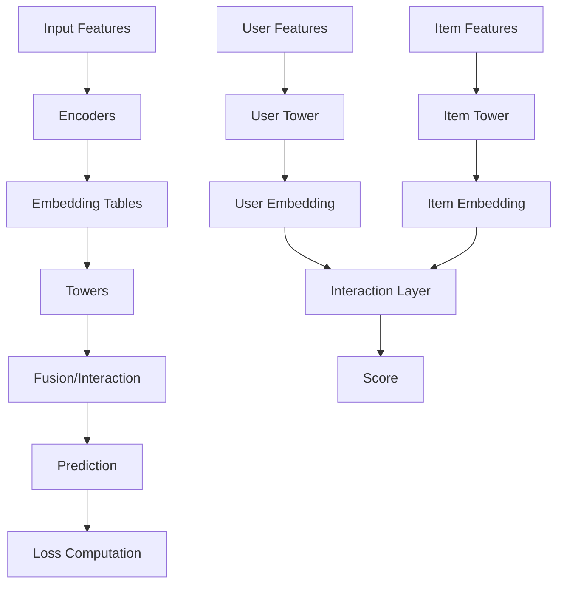

# Core Components

CoreRec's core components provide the building blocks for creating recommendation models. These components are reusable, modular, and work across all engines.

## Overview

The core components layer consists of:

- **Towers**: Neural network modules for encoding user/item features
- **Encoders**: Feature encoding and transformation
- **Embedding Tables**: Efficient embedding storage and retrieval
- **Losses**: Loss functions for different recommendation tasks
- **Base Model**: Foundation for all models

## Architecture



## Components Overview

### 1. Towers

Neural network modules that encode features into embeddings.

**Available Towers:**

- **MLPTower**: Multi-layer perceptron
- **CNNTower**: Convolutional neural networks
- **TransformerTower**: Self-attention mechanisms
- **FusionTower**: Multi-modal feature fusion

```python
from corerec.core.towers import UserTower, ItemTower

# User tower
user_tower = UserTower(
    input_dim=100,
    output_dim=64,
    config={
        'hidden_dims': [128, 64],
        'dropout': 0.2,
        'activation': 'relu'
    }
)

# Item tower
item_tower = ItemTower(
    input_dim=200,
    output_dim=64,
    config={
        'hidden_dims': [256, 128, 64],
        'dropout': 0.3
    }
)

# Forward pass
user_embedding = user_tower(user_features)
item_embedding = item_tower(item_features)
```

[**→ Learn more about Towers**](towers/index.md)

### 2. Encoders

Transform raw features into model-ready representations.

**Available Encoders:**

- **CategoricalEncoder**: Encode categorical features
- **NumericalEncoder**: Normalize numerical features
- **SequenceEncoder**: Encode sequential data
- **MultiModalEncoder**: Handle multiple modalities

```python
from corerec.core.encoders import CategoricalEncoder, NumericalEncoder

# Categorical encoder
cat_encoder = CategoricalEncoder(
    vocab_size=10000,
    embedding_dim=64
)

# Numerical encoder
num_encoder = NumericalEncoder(
    input_dim=50,
    output_dim=64,
    normalization='batch'
)

# Encode features
cat_embeddings = cat_encoder(categorical_features)
num_embeddings = num_encoder(numerical_features)
```

[**→ Learn more about Encoders**](encoders.md)

### 3. Embedding Tables

Efficient storage and retrieval of embeddings.

```python
from corerec.core.embedding_tables import EmbeddingTable

# Create embedding table
embedding_table = EmbeddingTable(
    num_embeddings=100000,
    embedding_dim=64,
    sparse=True,
    padding_idx=0
)

# Lookup embeddings
embeddings = embedding_table(ids)  # [batch_size, embedding_dim]
```

**Features:**

- Sparse embeddings for memory efficiency
- Shared embedding tables
- Initialization strategies
- Regularization support

[**→ Learn more about Embedding Tables**](embedding-tables.md)

### 4. Loss Functions

Various loss functions for different recommendation tasks.

**Available Losses:**

- **BCELoss**: Binary cross-entropy (implicit feedback)
- **MSELoss**: Mean squared error (rating prediction)
- **BPRLoss**: Bayesian personalized ranking (pairwise)
- **TripletLoss**: Metric learning
- **NCELoss**: Noise contrastive estimation
- **InfoNCELoss**: Contrastive learning

```python
from corerec.core.losses import BPRLoss, MSELoss

# BPR loss for implicit feedback
bpr_loss = BPRLoss()
loss = bpr_loss(pos_scores, neg_scores)

# MSE loss for rating prediction
mse_loss = MSELoss()
loss = mse_loss(predictions, targets)
```

[**→ Learn more about Losses**](losses.md)

### 5. Base Model

Foundation class for building custom models.

```python
from corerec.core.base_model import BaseModel
import torch.nn as nn

class MyRecommender(BaseModel):
    def __init__(self, config):
        super().__init__(config)
        
        # Define components
        self.user_tower = UserTower(...)
        self.item_tower = ItemTower(...)
        self.interaction = nn.Linear(128, 1)
    
    def forward(self, user_features, item_features):
        user_emb = self.user_tower(user_features)
        item_emb = self.item_tower(item_features)
        
        # Concatenate and predict
        combined = torch.cat([user_emb, item_emb], dim=1)
        score = self.interaction(combined)
        return score
```

[**→ Learn more about Base Model**](base-model.md)

## Building Custom Models

### Example 1: Two-Tower Model

```python
import torch
import torch.nn as nn
from corerec.core.towers import UserTower, ItemTower
from corerec.api.base_recommender import BaseRecommender

class TwoTowerRecommender(BaseRecommender):
    """Simple two-tower recommendation model"""
    
    def __init__(self, user_dim, item_dim, embedding_dim):
        super().__init__(name="TwoTower")
        
        # User tower
        self.user_tower = UserTower(
            input_dim=user_dim,
            output_dim=embedding_dim,
            config={'hidden_dims': [128, 64]}
        )
        
        # Item tower
        self.item_tower = ItemTower(
            input_dim=item_dim,
            output_dim=embedding_dim,
            config={'hidden_dims': [128, 64]}
        )
    
    def forward(self, user_features, item_features):
        """Compute dot product of user and item embeddings"""
        user_emb = self.user_tower(user_features)
        item_emb = self.item_tower(item_features)
        
        # Dot product
        scores = (user_emb * item_emb).sum(dim=1)
        return scores
    
    def fit(self, user_ids, item_ids, ratings):
        # Training logic
        self.is_fitted = True
        return self
    
    def predict(self, user_id, item_id):
        # Prediction logic
        pass
    
    def recommend(self, user_id, top_k=10):
        # Recommendation logic
        pass
```

### Example 2: Multi-Modal Model

```python
from corerec.core.towers import MLPTower, CNNTower, FusionTower
from corerec.core.encoders import MultiModalEncoder

class MultiModalRecommender(BaseRecommender):
    """Multi-modal recommendation model"""
    
    def __init__(self, config):
        super().__init__(name="MultiModal")
        
        # Text tower (MLP)
        self.text_tower = MLPTower(
            'text_tower',
            input_dim=300,  # Word embedding dim
            output_dim=64,
            config={'hidden_dims': [128, 64]}
        )
        
        # Image tower (CNN)
        self.image_tower = CNNTower(
            'image_tower',
            input_channels=3,
            output_dim=64,
            config={'conv_channels': [32, 64, 128]}
        )
        
        # Fusion tower
        self.fusion_tower = FusionTower(
            'fusion',
            input_dims=[64, 64],  # Text + Image
            output_dim=32,
            config={'fusion_type': 'concat'}
        )
        
        # Final prediction
        self.predictor = nn.Linear(32, 1)
    
    def forward(self, text_features, image_features):
        # Process each modality
        text_emb = self.text_tower(text_features)
        image_emb = self.image_tower(image_features)
        
        # Fuse modalities
        fused = self.fusion_tower([text_emb, image_emb])
        
        # Predict
        score = self.predictor(fused)
        return score
```

### Example 3: Attention-Based Model

```python
from corerec.core.towers import TransformerTower
from corerec.core.encoders import SequenceEncoder

class AttentionRecommender(BaseRecommender):
    """Attention-based sequential recommender"""
    
    def __init__(self, config):
        super().__init__(name="Attention")
        
        # Sequence encoder
        self.sequence_encoder = SequenceEncoder(
            vocab_size=10000,
            embedding_dim=64
        )
        
        # Transformer tower
        self.transformer_tower = TransformerTower(
            'transformer',
            input_dim=64,
            output_dim=64,
            config={
                'num_heads': 4,
                'num_layers': 2,
                'dropout': 0.1
            }
        )
        
        # Predictor
        self.predictor = nn.Linear(64, 10000)  # Predict next item
    
    def forward(self, sequences):
        # Encode sequences
        seq_emb = self.sequence_encoder(sequences)
        
        # Apply transformer
        attended = self.transformer_tower(seq_emb)
        
        # Predict next item
        logits = self.predictor(attended[:, -1, :])  # Use last position
        return logits
```

## Component Configuration

### YAML Configuration

```yaml
# model_config.yaml
user_tower:
  type: mlp
  input_dim: 100
  output_dim: 64
  hidden_dims: [128, 64]
  dropout: 0.2
  activation: relu
  norm: batch

item_tower:
  type: mlp
  input_dim: 200
  output_dim: 64
  hidden_dims: [256, 128, 64]
  dropout: 0.3
  activation: relu

loss:
  type: bpr
  margin: 1.0

optimizer:
  type: adam
  learning_rate: 0.001
  weight_decay: 0.0001
```

### Loading Configuration

```python
from corerec.config import ConfigManager
from corerec.core.towers import TowerFactory

# Load config
config = ConfigManager.from_yaml('model_config.yaml')

# Create components from config
user_tower = TowerFactory.create_tower(
    tower_type=config.user_tower.type,
    input_dim=config.user_tower.input_dim,
    output_dim=config.user_tower.output_dim,
    config=config.user_tower.to_dict()
)
```

## Best Practices

### 1. Modular Design

Break models into reusable components:

```python
class RecommenderModel(BaseRecommender):
    def __init__(self, config):
        super().__init__()
        
        # Separate components
        self.encoder = self._build_encoder(config)
        self.tower = self._build_tower(config)
        self.predictor = self._build_predictor(config)
    
    def _build_encoder(self, config):
        # Build encoder
        pass
    
    def _build_tower(self, config):
        # Build tower
        pass
    
    def _build_predictor(self, config):
        # Build predictor
        pass
```

### 2. Shared Components

Reuse components across models:

```python
# Shared embedding table
shared_embeddings = EmbeddingTable(
    num_embeddings=10000,
    embedding_dim=64
)

# Use in multiple towers
user_tower = UserTower(..., embedding_table=shared_embeddings)
item_tower = ItemTower(..., embedding_table=shared_embeddings)
```

### 3. Configuration-Driven

Use configs for flexibility:

```python
def create_model_from_config(config):
    """Factory function to create models from config"""
    if config.model_type == 'two_tower':
        return TwoTowerRecommender(config)
    elif config.model_type == 'multi_modal':
        return MultiModalRecommender(config)
    else:
        raise ValueError(f"Unknown model type: {config.model_type}")
```

## Performance Optimization

### 1. Efficient Embeddings

```python
# Use sparse embeddings for large vocab
embedding_table = EmbeddingTable(
    num_embeddings=1000000,
    embedding_dim=64,
    sparse=True  # Sparse gradients
)
```

### 2. Gradient Checkpointing

```python
# Save memory with gradient checkpointing
from torch.utils.checkpoint import checkpoint

def forward_with_checkpoint(self, x):
    return checkpoint(self.tower, x)
```

### 3. Mixed Precision

```python
# Use automatic mixed precision
from torch.cuda.amp import autocast

with autocast():
    output = model(input_features)
```

## Next Steps

- Explore [Towers](towers/index.md) for encoding architectures
- Learn about [Encoders](encoders.md) for feature transformation
- Understand [Losses](losses.md) for training objectives
- See [Examples](../examples/index.md) for complete implementations
- Read [Best Practices](../user-guide/best-practices.md) for optimization tips


