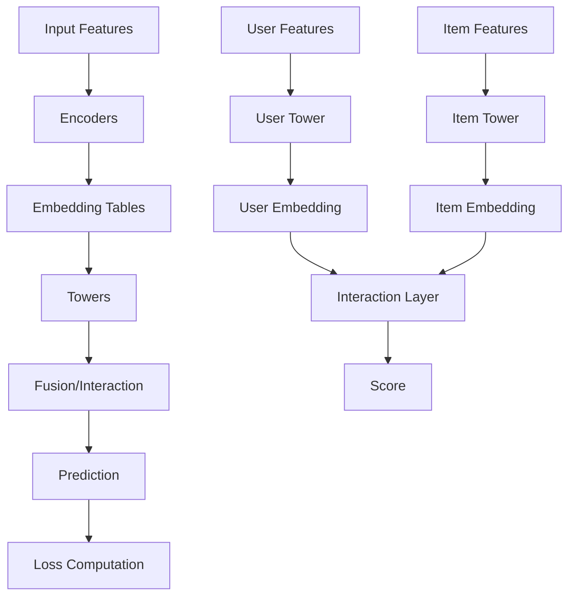

# Core Components

CoreRec's core components provide the building blocks for creating recommendation models. These components are reusable, modular, and work across all engines.

## Overview

The core components layer consists of:

- **Towers** (`corerec.core.towers`): MLP modules that encode user/item features into embeddings
- **Encoders** (`corerec.core.encoders`): pretrained text and image encoders (needs `corerec[transformers]`)
- **Embedding Tables**: plain `torch.nn.Embedding`; there is no CoreRec wrapper
- **Losses** (`corerec.core.losses`, `corerec.nn`): loss functions for different recommendation tasks
- **Base Model** (`corerec.core.base_model`): foundation for PyTorch modules

To build a whole new recommender and get training, `recommend()`, save/load,
serving and ONNX export for free, use `corerec.nn.Recommender` (the Custom
Models guide, `docs/source/user_guide/custom_models.md`, covers it in full).
The examples below use it where a full model is needed.

## Architecture


```mermaid
graph TB
    A[Input Features] --> B[Encoders]
    B --> C[Embedding Tables]
    C --> D[Towers]
    D --> E[Fusion/Interaction]
    E --> F[Prediction]
    F --> G[Loss Computation]
    
    H[User Features] --> I[User Tower]
    J[Item Features] --> K[Item Tower]
    I --> L[User Embedding]
    K --> M[Item Embedding]
    L --> N[Interaction Layer]
    M --> N
    N --> O[Score]
```

## Components Overview

### 1. Towers

Neural network modules that encode features into embeddings.

**Available Towers:**

- **MLPTower**: Multi-layer perceptron (`MLPTower(name, input_dim, output_dim, config)`)
- **UserTower**, **ItemTower**: an `MLPTower` with a fixed name
- **TowerFactory**: builds one of the above from a type string

`config` takes `hidden_dims`, `dropout`, `activation` (`relu`, `leaky_relu` or
`tanh`) and `norm` (`batch`, `layer` or `None`).

```python
import torch
from corerec.core.towers import UserTower, ItemTower

# User tower
user_tower = UserTower(
    input_dim=100,
    output_dim=64,
    config={
        'hidden_dims': [128, 64],
        'dropout': 0.2,
        'activation': 'relu'
    }
)

# Item tower
item_tower = ItemTower(
    input_dim=200,
    output_dim=64,
    config={
        'hidden_dims': [256, 128, 64],
        'dropout': 0.3
    }
)

# Forward pass
user_features = torch.randn(32, 100)
item_features = torch.randn(32, 200)
user_embedding = user_tower(user_features)   # [32, 64]
item_embedding = item_tower(item_features)   # [32, 64]
```

A tower also accepts integer ids instead of a feature matrix: `user_tower(ids)`
gives the same result as a one-hot row, without building one.

[**→ Learn more about Towers**](towers/index.md)

### 2. Encoders

Turn raw text or images into vectors with a pretrained HuggingFace model.

**Available Encoders:**

- **TextEncoder**: text, via a HuggingFace language model (`model_name`, `pooling`, `max_length`, `trainable`)
- **VisionEncoder**: images, via a HuggingFace vision model
- **AbstractEncoder**: base class for writing your own

These need the optional dependency, and the first call downloads the model:

```bash
pip install "corerec[transformers]"
```

```python
from corerec.core.encoders import TextEncoder

text_encoder = TextEncoder(
    "item_text",
    config={
        'model_name': 'distilbert-base-uncased',
        'pooling': 'mean',
        'max_length': 64
    }
)

# Encode item descriptions
text_embeddings = text_encoder.encode(["red running shoes", "wireless earbuds"])
# [2, hidden_size]
```

Categorical and numerical features don't need a CoreRec class: use
`nn.Embedding` for ids (next section) and pass numbers straight into a tower.


### 3. Embedding Tables

Use `torch.nn.Embedding`. CoreRec's own models and `corerec.nn` index items
`1..n_items` and keep `0` for padding:

```python
import torch
import torch.nn as nn

# Create embedding table
n_items = 100000
embedding_table = nn.Embedding(
    num_embeddings=n_items + 1,
    embedding_dim=64,
    sparse=True,
    padding_idx=0
)

# Lookup embeddings
ids = torch.tensor([1, 42, 0])
embeddings = embedding_table(ids)  # [3, 64]; the padding row stays zero
```

**Features:**

- `sparse=True` for sparse gradients (pair with `torch.optim.SparseAdam`)
- Shared tables: pass the same module to several towers
- Initialization: `nn.init.normal_(table.weight, std=0.05)`; the default N(0, 1) is too large for dot-product models
- Regularization: `weight_decay` on the optimizer


### 4. Loss Functions

Various loss functions for different recommendation tasks.

**Available Losses:**

- **DotProductLoss** (`corerec.core.losses`): BCE on user/item dot products, for labelled pairs
- **CosineLoss** (`corerec.core.losses`): the same on cosine similarity
- **InfoNCE** (`corerec.core.losses`): contrastive, in-batch or explicit negatives
- **bpr_loss**, **bce_loss**, **sampled_softmax_loss** (`corerec.nn`): take a
  `[B, 1 + negatives]` score matrix, positive in column 0; these are what
  `corerec.nn.Recommender(loss=...)` uses
- **MSE** for rating prediction: `torch.nn.MSELoss`

```python
import torch
from corerec.core.losses import DotProductLoss, InfoNCE
from corerec.nn import bpr_loss

user_emb, item_emb = torch.randn(32, 64), torch.randn(32, 64)
labels = torch.randint(0, 2, (32,)).float()

# Pointwise loss on labelled (user, item) pairs
loss = DotProductLoss()(user_emb, item_emb, labels)

# Contrastive loss, other items in the batch act as negatives
loss = InfoNCE(temperature=0.07)(user_emb, item_emb)

# BPR for implicit feedback: column 0 is the positive, the rest negatives
scores = torch.randn(32, 1 + 4)
loss = bpr_loss(scores)
```


### 5. Base Model

Foundation class for PyTorch modules: `BaseModel(name, config)` adds
`save`/`load`, `get_num_parameters()`, `freeze()`/`unfreeze()` and
`train_step()` on top of `nn.Module`.

```python
import torch
import torch.nn as nn
from corerec.core.base_model import BaseModel
from corerec.core.towers import UserTower, ItemTower

class MyRecommender(BaseModel):
    def __init__(self, config):
        super().__init__("my_recommender", config)
        
        # Define components
        self.user_tower = UserTower(config['user_dim'], 64, {'hidden_dims': [128]})
        self.item_tower = ItemTower(config['item_dim'], 64, {'hidden_dims': [128]})
        self.interaction = nn.Linear(128, 1)
    
    def forward(self, user_features, item_features):
        user_emb = self.user_tower(user_features)
        item_emb = self.item_tower(item_features)
        
        # Concatenate and predict
        combined = torch.cat([user_emb, item_emb], dim=1)
        score = self.interaction(combined)
        return score

model = MyRecommender({'user_dim': 100, 'item_dim': 200})
score = model(torch.randn(8, 100), torch.randn(8, 200))   # [8, 1]
print(model.get_num_parameters())
```


## Building Custom Models

### Example 1: Two-Tower Model

Wrap an `nn.Module` with `forward(users, items) -> scores` in
`corerec.nn.Recommender`; it supplies `n_users` and `n_items` and does the
training loop, negative sampling and `recommend()`:

```python
import numpy as np
import torch
import torch.nn as nn
from corerec.core.towers import UserTower, ItemTower
from corerec.nn import Recommender

class TwoTowerModule(nn.Module):
    """Simple two-tower recommendation model"""
    
    def __init__(self, n_users, n_items, embedding_dim=32):
        super().__init__()
        
        # User tower: user index -> embedding
        self.user_tower = UserTower(
            input_dim=n_users,
            output_dim=embedding_dim,
            config={'hidden_dims': [64]}
        )
        
        # Item tower: item index (1..n_items, 0 = padding) -> embedding
        self.item_tower = ItemTower(
            input_dim=n_items + 1,
            output_dim=embedding_dim,
            config={'hidden_dims': [64]}
        )
    
    def forward(self, users, items):
        """users [B], items [B, K] -> dot-product scores [B, K]"""
        user_emb = self.user_tower(users)                                  # [B, d]
        item_emb = self.item_tower(items).reshape(*items.shape, -1)        # [B, K, d]
        
        # Dot product
        return (user_emb.unsqueeze(1) * item_emb).sum(-1)

rng = np.random.default_rng(0)
users = rng.integers(0, 100, 2000).tolist()
items = rng.integers(0, 300, 2000).tolist()

rec = Recommender(TwoTowerModule, {'embedding_dim': 32}, loss="bpr", epochs=3, lr=0.01)
rec.fit(users, items)
print(rec.recommend(users[0], top_k=10))
```

`rec.save()`, `ModelServer` and `corerec.export.to_onnx` work on it like on
any built-in model.

### Example 2: Multi-Modal Model

There are no CNN or fusion towers in `corerec.core`; encode each modality
with its own tower (or a `TextEncoder`/`VisionEncoder` upstream) and fuse with
plain PyTorch:

```python
import torch
import torch.nn as nn
from corerec.core.towers import MLPTower

class MultiModalModel(nn.Module):
    """Multi-modal recommendation model"""
    
    def __init__(self, text_dim=300, image_dim=512):
        super().__init__()
        
        # Text tower (e.g. averaged word vectors)
        self.text_tower = MLPTower(
            'text_tower',
            input_dim=text_dim,
            output_dim=64,
            config={'hidden_dims': [128]}
        )
        
        # Image tower (e.g. features from a pretrained CNN or VisionEncoder)
        self.image_tower = MLPTower(
            'image_tower',
            input_dim=image_dim,
            output_dim=64,
            config={'hidden_dims': [128]}
        )
        
        # Fusion: concatenate, then a small MLP
        self.fusion = nn.Sequential(nn.Linear(128, 32), nn.ReLU())
        
        # Final prediction
        self.predictor = nn.Linear(32, 1)
    
    def forward(self, text_features, image_features):
        # Process each modality
        text_emb = self.text_tower(text_features)
        image_emb = self.image_tower(image_features)
        
        # Fuse modalities
        fused = self.fusion(torch.cat([text_emb, image_emb], dim=1))
        
        # Predict
        return self.predictor(fused)

model = MultiModalModel()
score = model(torch.randn(16, 300), torch.randn(16, 512))   # [16, 1]
```

### Example 3: Attention-Based Model

`corerec.nn` ships a causal self-attention template; `inputs="history"` makes
`Recommender` feed it each user's item history:

```python
import numpy as np
from corerec.nn import Recommender, SequentialTransformer

# toy sequences: each user walks through consecutive item ids
rng = np.random.default_rng(0)
users, items = [], []
for u in range(200):
    start = int(rng.integers(1, 80))
    for step in range(6):
        users.append(u)
        items.append(start + step)

rec = Recommender(
    SequentialTransformer,
    {'dim': 32, 'num_blocks': 2, 'heads': 2},
    inputs="history",
    max_len=20,
    epochs=5,
    lr=0.005
)
rec.fit(users, items)

# Predict next item
print(rec.recommend(0, top_k=5))
```

To try a different attention block, copy `SequentialTransformer` from
`corerec/nn/models.py` and swap `SASRecBlock` for `HSTUBlock` or your own.

## Component Configuration

### YAML Configuration

```yaml
# model_config.yaml
user_tower:
  type: user
  input_dim: 100
  output_dim: 64
  hidden_dims: [128, 64]
  dropout: 0.2
  activation: relu
  norm: batch

item_tower:
  type: item
  input_dim: 200
  output_dim: 64
  hidden_dims: [256, 128, 64]
  dropout: 0.3
  activation: relu
```

### Loading Configuration

```python
import yaml
from corerec.core.towers import TowerFactory

# Load config
with open('model_config.yaml') as f:
    config = yaml.safe_load(f)

# Create components from config ('mlp', 'user' or 'item')
towers = {
    name: TowerFactory.create_tower(
        tower_type=cfg['type'],
        input_dim=cfg['input_dim'],
        output_dim=cfg['output_dim'],
        config=cfg
    )
    for name, cfg in config.items()
}
user_tower = towers['user_tower']
```

## Best Practices

### 1. Modular Design

Break models into reusable components:

```python
import torch.nn as nn
from corerec.core.towers import MLPTower

class RecommenderModel(nn.Module):
    def __init__(self, config):
        super().__init__()
        
        # Separate components
        self.encoder = self._build_encoder(config)
        self.tower = self._build_tower(config)
        self.predictor = self._build_predictor(config)
    
    def _build_encoder(self, config):
        return nn.Embedding(config['n_items'] + 1, config['dim'], padding_idx=0)
    
    def _build_tower(self, config):
        return MLPTower('tower', config['dim'], config['dim'], {'hidden_dims': [config['dim']]})
    
    def _build_predictor(self, config):
        return nn.Linear(config['dim'], 1)
    
    def forward(self, item_ids):
        return self.predictor(self.tower(self.encoder(item_ids)))

model = RecommenderModel({'n_items': 1000, 'dim': 32})
```

### 2. Shared Components

Reuse components across models:

```python
import torch.nn as nn

# Shared embedding table
shared_embeddings = nn.Embedding(
    num_embeddings=10000,
    embedding_dim=64
)

# Use in multiple modules: both see (and train) the same weights
class QueryEncoder(nn.Module):
    def __init__(self, table):
        super().__init__()
        self.table = table

query_encoder = QueryEncoder(shared_embeddings)
candidate_encoder = QueryEncoder(shared_embeddings)
assert query_encoder.table.weight is candidate_encoder.table.weight
```

### 3. Configuration-Driven

Use configs for flexibility:

```python
def create_model_from_config(config):
    """Factory function to create models from config"""
    if config['model_type'] == 'two_tower':
        return TwoTowerModule(config['n_users'], config['n_items'])
    elif config['model_type'] == 'multi_modal':
        return MultiModalModel()
    else:
        raise ValueError(f"Unknown model type: {config['model_type']}")
```

## Performance Optimization

### 1. Efficient Embeddings

```python
import torch
import torch.nn as nn

# Use sparse embeddings for large vocab
embedding_table = nn.Embedding(
    num_embeddings=1000000,
    embedding_dim=64,
    sparse=True  # Sparse gradients
)
optimizer = torch.optim.SparseAdam(embedding_table.parameters(), lr=1e-3)
```

### 2. Gradient Checkpointing

```python
# Save memory with gradient checkpointing
from torch.utils.checkpoint import checkpoint

def forward_with_checkpoint(self, x):
    return checkpoint(self.tower, x, use_reentrant=False)
```

### 3. Mixed Precision

```python
# Use automatic mixed precision
import torch
import torch.nn as nn

model = nn.Linear(64, 1)
input_features = torch.randn(8, 64)

device_type = "cuda" if torch.cuda.is_available() else "cpu"
with torch.autocast(device_type=device_type, dtype=torch.bfloat16):
    output = model(input_features)
```

## Next Steps

- Explore [Towers](towers/index.md) for encoding architectures
- See the Custom Models guide (`docs/source/user_guide/custom_models.md`) to build and train a new model with `corerec.nn`
- See [Examples](../examples/index.md) for complete implementations
