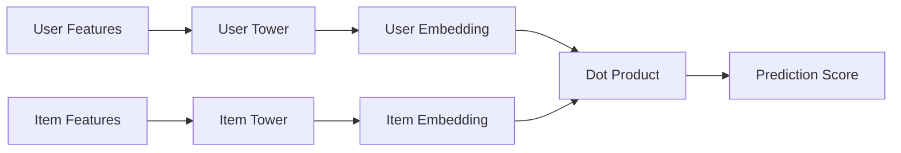

# Towers

Towers are neural network modules in CoreRec that encode user or item features into embeddings. They are the building blocks for creating two-tower and multi-tower recommendation architectures.

## Overview

A **tower** is a neural network that transforms raw features into dense embeddings in a shared latent space. CoreRec provides several pre-built tower architectures that can be easily customized and combined.



## Available Towers

### 1. MLPTower

Multi-layer perceptron tower for dense features.

**Features:**
- Configurable hidden layers
- Multiple activation functions (ReLU, Tanh, LeakyReLU)
- Batch/Layer normalization
- Dropout regularization

[**→ MLP Tower Documentation**](mlp-tower.md)

### 2. CNNTower

Convolutional neural network tower for image or sequential data.

**Features:**
- Multiple convolutional layers
- Pooling strategies (max, average, adaptive)
- Batch normalization
- Residual connections

[**→ CNN Tower Documentation**](cnn-tower.md)

### 3. TransformerTower

Self-attention based tower for sequential data.

**Features:**
- Multi-head self-attention
- Position encoding
- Layer normalization
- Feed-forward networks

[**→ Transformer Tower Documentation**](transformer-tower.md)

### 4. FusionTower

Multi-modal fusion tower for combining different feature types.

**Features:**
- Multiple fusion strategies (concat, attention, gating)
- Cross-modal interactions
- Dynamic weighting

[**→ Fusion Tower Documentation**](fusion-tower.md)

## Quick Start

### Basic Two-Tower Model

```python
from corerec.core.towers import UserTower, ItemTower
import torch

# Create towers
user_tower = UserTower(
    input_dim=100,  # User feature dimension
    output_dim=64,  # Embedding dimension
    config={
        'hidden_dims': [128, 64],
        'dropout': 0.2,
        'activation': 'relu',
        'norm': 'batch'
    }
)

item_tower = ItemTower(
    input_dim=200,  # Item feature dimension
    output_dim=64,  # Embedding dimension (same as user)
    config={
        'hidden_dims': [256, 128, 64],
        'dropout': 0.3,
        'activation': 'relu'
    }
)

# Forward pass
user_features = torch.randn(32, 100)  # Batch of 32 users
item_features = torch.randn(32, 200)  # Batch of 32 items

user_embeddings = user_tower(user_features)  # [32, 64]
item_embeddings = item_tower(item_features)  # [32, 64]

# Compute scores (dot product)
scores = (user_embeddings * item_embeddings).sum(dim=1)  # [32]
```

### Creating Custom Towers

```python
from corerec.core.towers import Tower
import torch.nn as nn

class CustomTower(Tower):
    """Custom tower with your own architecture"""
    
    def __init__(self, name, input_dim, output_dim, config):
        super().__init__(name, input_dim, output_dim, config)
    
    def _build_network(self):
        """Build the tower network"""
        # Custom architecture
        self.fc1 = nn.Linear(self.input_dim, 128)
        self.bn1 = nn.BatchNorm1d(128)
        self.relu = nn.ReLU()
        self.dropout = nn.Dropout(0.2)
        self.fc2 = nn.Linear(128, self.output_dim)
    
    def forward(self, x):
        """Forward pass"""
        x = self.fc1(x)
        x = self.bn1(x)
        x = self.relu(x)
        x = self.dropout(x)
        x = self.fc2(x)
        return x

# Use custom tower
custom_tower = CustomTower(
    name='custom',
    input_dim=100,
    output_dim=64,
    config={}
)
```

## Tower Factory

Use the factory pattern to create towers from configuration:

```python
from corerec.core.towers import TowerFactory

# Create MLP tower
mlp_tower = TowerFactory.create_tower(
    tower_type='mlp',
    input_dim=100,
    output_dim=64,
    config={'hidden_dims': [128, 64]}
)

# Create user tower
user_tower = TowerFactory.create_tower(
    tower_type='user',
    input_dim=100,
    output_dim=64,
    config={'hidden_dims': [128, 64]}
)

# Create item tower
item_tower = TowerFactory.create_tower(
    tower_type='item',
    input_dim=200,
    output_dim=64,
    config={'hidden_dims': [256, 128, 64]}
)
```

## Configuration

### Tower Configuration Schema

```python
config = {
    # Architecture
    'hidden_dims': [128, 64, 32],      # List of hidden layer sizes
    
    # Regularization
    'dropout': 0.2,                     # Dropout rate
    'norm': 'batch',                    # Normalization: 'batch', 'layer', None
    
    # Activation
    'activation': 'relu',               # Activation: 'relu', 'tanh', 'leaky_relu'
    
    # Advanced
    'residual': False,                  # Use residual connections
    'attention': False,                 # Use attention mechanism
}
```

### Loading from YAML

```yaml
# tower_config.yaml
user_tower:
  type: mlp
  input_dim: 100
  output_dim: 64
  config:
    hidden_dims: [128, 64]
    dropout: 0.2
    activation: relu
    norm: batch

item_tower:
  type: mlp
  input_dim: 200
  output_dim: 64
  config:
    hidden_dims: [256, 128, 64]
    dropout: 0.3
    activation: relu
```

```python
from corerec.config import ConfigManager

# Load config
config = ConfigManager.from_yaml('tower_config.yaml')

# Create towers
user_tower = TowerFactory.create_tower(
    tower_type=config.user_tower.type,
    input_dim=config.user_tower.input_dim,
    output_dim=config.user_tower.output_dim,
    config=config.user_tower.config
)
```

## Tower Patterns

### 1. Symmetric Towers

User and item towers with same architecture:

```python
# Shared configuration
tower_config = {
    'hidden_dims': [128, 64],
    'dropout': 0.2,
    'activation': 'relu'
}

user_tower = UserTower(100, 64, tower_config)
item_tower = ItemTower(200, 64, tower_config)
```

### 2. Asymmetric Towers

Different architectures for users and items:

```python
# Deeper item tower for rich item features
user_tower = UserTower(
    100, 64,
    {'hidden_dims': [128, 64]}
)

item_tower = ItemTower(
    500, 64,
    {'hidden_dims': [512, 256, 128, 64]}
)
```

### 3. Multi-Modal Towers

Separate towers for different modalities:

```python
# Text tower
text_tower = MLPTower(
    'text', 300, 64,
    {'hidden_dims': [128, 64]}
)

# Image tower
image_tower = CNNTower(
    'image', 3, 64,
    {'conv_channels': [32, 64, 128]}
)

# Fusion tower
fusion_tower = FusionTower(
    'fusion', [64, 64], 64,
    {'fusion_type': 'attention'}
)

# Combine
text_emb = text_tower(text_features)
image_emb = image_tower(image_features)
fused = fusion_tower([text_emb, image_emb])
```

## Advanced Features

### Shared Weights

Share parameters between towers:

```python
# Shared embedding layer
shared_embedding = nn.Embedding(10000, 64)

class SharedTower(Tower):
    def __init__(self, name, input_dim, output_dim, config):
        self.shared_embedding = config.get('shared_embedding')
        super().__init__(name, input_dim, output_dim, config)
    
    def _build_network(self):
        # Use shared embedding
        self.fc = nn.Linear(64, self.output_dim)
    
    def forward(self, x):
        emb = self.shared_embedding(x)
        return self.fc(emb)
```

### Attention Mechanisms

Add attention to towers:

```python
class AttentiveTower(MLPTower):
    def __init__(self, name, input_dim, output_dim, config):
        super().__init__(name, input_dim, output_dim, config)
        self.attention = nn.MultiheadAttention(
            embed_dim=output_dim,
            num_heads=4
        )
    
    def forward(self, x):
        # MLP encoding
        x = super().forward(x)
        
        # Self-attention
        x = x.unsqueeze(0)  # Add sequence dimension
        attended, _ = self.attention(x, x, x)
        x = attended.squeeze(0)
        
        return x
```

### Residual Connections

Add skip connections:

```python
class ResidualTower(MLPTower):
    def forward(self, x):
        identity = x
        
        # Process through layers
        x = self.network(x)
        
        # Add residual if dimensions match
        if x.shape == identity.shape:
            x = x + identity
        
        return x
```

## Performance Optimization

### 1. Gradient Checkpointing

Save memory for deep towers:

```python
from torch.utils.checkpoint import checkpoint

class DeepTower(Tower):
    def forward(self, x):
        # Use gradient checkpointing for memory efficiency
        return checkpoint(self.network, x)
```

### 2. Efficient Normalization

Choose appropriate normalization:

```python
# Batch norm for large batches
config = {'norm': 'batch'}

# Layer norm for small batches or sequences
config = {'norm': 'layer'}

# No norm for fast inference
config = {'norm': None}
```

### 3. Mixed Precision

Use automatic mixed precision:

```python
from torch.cuda.amp import autocast

with autocast():
    user_emb = user_tower(user_features)
    item_emb = item_tower(item_features)
    scores = (user_emb * item_emb).sum(dim=1)
```

## Best Practices

1. **Match Embedding Dimensions**: User and item towers should output same dimension
2. **Normalize Embeddings**: Consider L2 normalization for similarity tasks
3. **Batch Normalization**: Use batch norm for stable training
4. **Dropout**: Add dropout to prevent overfitting
5. **Residual Connections**: For deep towers (>3 layers)
6. **Activation Functions**: ReLU for general purpose, Tanh for bounded outputs

## Example: Complete Two-Tower Model

```python
import torch
import torch.nn as nn
from corerec.core.towers import UserTower, ItemTower
from corerec.api.base_recommender import BaseRecommender

class TwoTowerModel(BaseRecommender):
    """Complete two-tower recommendation model"""
    
    def __init__(self, user_dim, item_dim, embedding_dim=64):
        super().__init__(name="TwoTower")
        
        # User tower
        self.user_tower = UserTower(
            input_dim=user_dim,
            output_dim=embedding_dim,
            config={
                'hidden_dims': [128, 64],
                'dropout': 0.2,
                'activation': 'relu',
                'norm': 'batch'
            }
        )
        
        # Item tower
        self.item_tower = ItemTower(
            input_dim=item_dim,
            output_dim=embedding_dim,
            config={
                'hidden_dims': [256, 128, 64],
                'dropout': 0.3,
                'activation': 'relu',
                'norm': 'batch'
            }
        )
        
        # Loss function
        self.criterion = nn.BCEWithLogitsLoss()
        self.optimizer = torch.optim.Adam(
            self.parameters(),
            lr=0.001
        )
    
    def forward(self, user_features, item_features):
        """Forward pass"""
        # Encode users and items
        user_emb = self.user_tower(user_features)
        item_emb = self.item_tower(item_features)
        
        # L2 normalize embeddings
        user_emb = nn.functional.normalize(user_emb, p=2, dim=1)
        item_emb = nn.functional.normalize(item_emb, p=2, dim=1)
        
        # Dot product
        scores = (user_emb * item_emb).sum(dim=1)
        return scores
    
    def fit(self, user_features, item_features, labels, epochs=10):
        """Train the model"""
        self.train()
        
        for epoch in range(epochs):
            # Forward pass
            scores = self.forward(user_features, item_features)
            loss = self.criterion(scores, labels)
            
            # Backward pass
            self.optimizer.zero_grad()
            loss.backward()
            self.optimizer.step()
            
            print(f"Epoch {epoch+1}/{epochs}, Loss: {loss.item():.4f}")
        
        self.is_fitted = True
        return self
    
    def predict(self, user_id, item_id):
        """Predict score for user-item pair"""
        self.eval()
        with torch.no_grad():
            score = self.forward(user_features, item_features)
        return score.item()
    
    def recommend(self, user_id, top_k=10):
        """Generate recommendations"""
        # Implementation
        pass
    
    def save(self, path):
        """Save model"""
        torch.save(self.state_dict(), path)
    
    @classmethod
    def load(cls, path):
        """Load model"""
        model = cls(user_dim=100, item_dim=200)
        model.load_state_dict(torch.load(path))
        return model
```

## Next Steps

- Learn about specific tower types:
  - [MLP Tower](mlp-tower.md)
  - [CNN Tower](cnn-tower.md)
  - [Transformer Tower](transformer-tower.md)
  - [Fusion Tower](fusion-tower.md)
- Explore [Encoders](../encoders.md) for feature transformation
- See [Examples](../../examples/index.md) for complete implementations
- Read [Best Practices](../../user-guide/best-practices.md) for optimization tips


