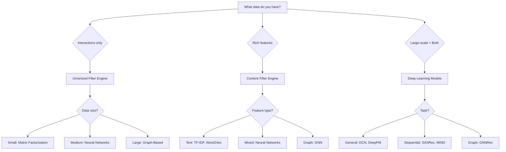

# Engines Overview

CoreRec provides three main recommendation engines, each containing state-of-the-art algorithms for different recommendation scenarios.

## Engine Architecture

```mermaid
graph TB
    A[CoreRec Engines] --> B[Unionized Filter Engine]
    A --> C[Content Filter Engine]
    A --> D[Deep Learning Models]
    
    B --> B1[Matrix Factorization]
    B --> B2[Neural Networks]
    B --> B3[Graph-Based]
    B --> B4[Attention Mechanisms]
    B --> B5[Bayesian Methods]
    B --> B6[Sequential Models]
    B --> B7[Variational Encoders]
    
    C --> C1[Traditional ML]
    C --> C2[Neural Networks]
    C --> C3[Graph-Based]
    C --> C4[Embedding Learning]
    C --> C5[Hybrid & Ensemble]
    C --> C6[Fairness & Explainability]
    C --> C7[Learning Paradigms]
    
    D --> D1[DCN]
    D --> D2[DeepFM]
    D --> D3[GNNRec]
    D --> D4[MIND]
    D --> D5[NASRec]
    D --> D6[SASRec]
```



## Quick Comparison

| Engine | Best For | Algorithms | Data Required |
|--------|----------|------------|---------------|
| **Unionized Filter** | User-item interactions | 50+ algorithms | Interaction matrix |
| **Content Filter** | Feature-rich data | 40+ algorithms | Item/user features |
| **Deep Learning** | Large-scale data | 6 SOTA models | Interaction + features |

## 1. Unionized Filter Engine

**Collaborative filtering and hybrid recommendation methods**

The Unionized Filter Engine specializes in collaborative filtering approaches that learn from user-item interactions.

### Categories

#### Matrix Factorization
Decompose user-item matrix into latent factors:

- **SVD** (Singular Value Decomposition)
- **ALS** (Alternating Least Squares)
- **NMF** (Non-negative Matrix Factorization)
- **PMF** (Probabilistic Matrix Factorization)
- **WNMF** (Weighted NMF)

```python
from corerec.engines.unionizedFilterEngine.mf_base.SVD_base import SVD

model = SVD(n_factors=50, n_epochs=20)
model.fit(user_ids, item_ids, ratings)
recs = model.recommend(user_id=123, top_k=10)
```

#### Neural Network Based
Deep learning for collaborative filtering:

- **NCF** (Neural Collaborative Filtering)
- **DeepFM** (Deep Factorization Machines)
- **AutoInt** (Automatic Feature Interaction)
- **DCN** (Deep & Cross Network)
- **AFM** (Attentional Factorization Machines)
- **DIN** (Deep Interest Network)
- **DIEN** (Deep Interest Evolution Network)

```python
from corerec.engines.unionizedFilterEngine.nn_base.NCF_base import NCF

model = NCF(embedding_dim=64, layers=[128, 64, 32])
model.fit(user_ids, item_ids, ratings)
```

#### Graph-Based
Leverage graph structure for recommendations:

- **LightGCN** (Light Graph Convolutional Network)
- **DeepWalk** (Random walk embeddings)
- **GNN** (Graph Neural Networks)
- **GeoimC** (Geometric Matrix Completion)

```python
from corerec.engines.unionizedFilterEngine.graph_based_base.lightgcn import LightGCN

model = LightGCN(embedding_dim=64, num_layers=3)
model.fit(user_ids, item_ids, ratings)
```

#### Attention Mechanisms
Attention-based recommendations:

- **SASRec** (Self-Attentive Sequential Recommendation)
- **Transformer** (Transformer-based recommenders)
- **A2SVD** (Attentive Collaborative Filtering)

```python
from corerec.engines.unionizedFilterEngine.attention_mechanism_base.sasrec import SASRec

model = SASRec(hidden_units=64, num_blocks=2, num_heads=4)
model.fit(user_ids, item_ids, timestamps)
```

#### Bayesian Methods
Probabilistic approaches:

- **BPR** (Bayesian Personalized Ranking)
- **Bayesian MF** (Bayesian Matrix Factorization)
- **VMF** (von Mises-Fisher)

#### Sequential Models
Time-aware recommendations:

- **LSTM** (Long Short-Term Memory)
- **GRU** (Gated Recurrent Unit)
- **Caser** (Convolutional Sequence Embedding)
- **NextItNet** (Next Item Network)

#### Variational Encoders
Generative models:

- **VAE** (Variational Autoencoder)
- **CVAE** (Conditional VAE)
- **Beta-VAE**

[**→ Learn more about Unionized Filter Engine**](unionized-filter/index.md)

---

## 2. Content Filter Engine

**Content-based and feature-rich recommendation methods**

The Content Filter Engine focuses on item and user features for recommendations.

### Categories

#### Traditional ML
Classical machine learning algorithms:

- **TF-IDF** (Term Frequency-Inverse Document Frequency)
- **SVM** (Support Vector Machines)
- **Decision Trees**
- **LightGBM** (Gradient Boosting)
- **Logistic Regression**
- **Vowpal Wabbit**

```python
from corerec.engines.contentFilterEngine.tfidf_recommender import TFIDFRecommender

model = TFIDFRecommender(feature_column='description')
model.fit(items_df)
similar = model.recommend_similar(item_id=123, top_k=10)
```

#### Neural Networks
Deep learning for content-based filtering:

- **DSSM** (Deep Structured Semantic Model)
- **MIND** (Multi-Interest Network)
- **TDM** (Tree-based Deep Model)
- **YouTube DNN**
- **CNN**, **RNN**, **Transformers**
- **Autoencoders**, **VAE**

```python
from corerec.engines.contentFilterEngine.nn_based_algorithms.DSSM import DSSM

model = DSSM(embedding_dim=128, hidden_layers=[256, 128])
model.fit(user_features, item_features, interactions)
```

#### Graph-Based
Graph neural networks for content:

- **GNN** (Graph Neural Networks)
- **Semantic Models**
- **Graph Filtering**

#### Embedding Learning
Learn feature embeddings:

- **Word2Vec**
- **Doc2Vec**
- **Personalized Embeddings**

```python
from corerec.engines.contentFilterEngine.embedding_representation_learning.word2vec import Word2VecRecommender

model = Word2VecRecommender(vector_size=100)
model.fit(item_descriptions)
```

#### Hybrid & Ensemble
Combine multiple models:

- **Attention Mechanisms**
- **Ensemble Methods**
- **Hybrid Collaborative-Content**

#### Fairness & Explainability
Responsible AI for recommendations:

- **Fair Ranking**
- **Explainable Recommendations**
- **Privacy-Preserving Methods**

#### Learning Paradigms
Advanced learning techniques:

- **Transfer Learning**
- **Meta Learning**
- **Few-shot Learning**
- **Zero-shot Learning**

[**→ Learn more about Content Filter Engine**](content-filter/index.md)

---

## 3. Deep Learning Models

**State-of-the-art deep learning architectures**

Production-ready implementations of cutting-edge deep learning models.

### Available Models

#### DCN (Deep & Cross Network)
Automatic feature crossing with deep networks:

```python
from corerec.engines.dcn import DCN

model = DCN(
    embedding_dim=64,
    num_cross_layers=3,
    deep_layers=[128, 64, 32],
    epochs=20
)
model.fit(user_ids, item_ids, ratings)
```

[**→ DCN Documentation**](deep-learning/dcn.md)

#### DeepFM (Deep Factorization Machines)
Combines factorization machines with deep learning:

```python
from corerec.engines.deepfm import DeepFM

model = DeepFM(
    embedding_dim=64,
    hidden_layers=[128, 64, 32],
    epochs=20
)
model.fit(user_ids, item_ids, ratings)
```

[**→ DeepFM Documentation**](deep-learning/deepfm.md)

#### GNNRec (Graph Neural Network Recommender)
Graph neural networks for recommendations:

```python
from corerec.engines.gnnrec import GNNRec

model = GNNRec(
    embedding_dim=64,
    num_gnn_layers=3,
    epochs=20
)
model.fit(user_ids, item_ids, ratings)
```

[**→ GNNRec Documentation**](deep-learning/gnnrec.md)

#### MIND (Multi-Interest Network)
Capture diverse user interests:

```python
from corerec.engines.mind import MIND

model = MIND(
    embedding_dim=64,
    num_interests=4,
    epochs=20
)
model.fit(user_ids, item_ids, timestamps)
```

[**→ MIND Documentation**](deep-learning/mind.md)

#### NASRec (Neural Architecture Search)
Automatically discover optimal architectures:

```python
from corerec.engines.nasrec import NASRec

model = NASRec(
    embedding_dim=64,
    hidden_dims=[128, 64],
    epochs=20
)
model.fit(user_ids, item_ids, ratings)
```

[**→ NASRec Documentation**](deep-learning/nasrec.md)

#### SASRec (Self-Attentive Sequential)
Self-attention for sequential recommendations:

```python
from corerec.engines.sasrec import SASRec

model = SASRec(
    hidden_units=64,
    num_blocks=2,
    num_heads=4,
    num_epochs=20
)
model.fit(interaction_matrix, user_ids, item_ids)
```

[**→ SASRec Documentation**](deep-learning/sasrec.md)

---

## Choosing the Right Engine

### Decision Tree



### Use Case Matrix

| Use Case | Recommended Engine | Best Model |
|----------|-------------------|------------|
| Movie Recommendations | Unionized Filter | NCF, SASRec |
| Product Recommendations | Deep Learning | DeepFM, DCN |
| News Articles | Content Filter | TF-IDF, DSSM |
| Music Playlists | Unionized Filter | MIND, SASRec |
| Social Network | Unionized Filter | LightGCN, GNN |
| E-commerce | Deep Learning | DeepFM, DCN |
| Video Recommendations | Deep Learning | MIND, SASRec |
| Books | Content Filter | TF-IDF, Word2Vec |

## Performance Comparison

| Model | Training Speed | Inference Speed | Accuracy | Scalability |
|-------|---------------|-----------------|----------|-------------|
| SVD | ⚡⚡⚡ | ⚡⚡⚡ | ⭐⭐⭐ | ⭐⭐⭐ |
| NCF | ⚡⚡ | ⚡⚡ | ⭐⭐⭐⭐ | ⭐⭐⭐⭐ |
| LightGCN | ⚡⚡ | ⚡⚡⚡ | ⭐⭐⭐⭐⭐ | ⭐⭐⭐⭐ |
| DCN | ⚡⚡ | ⚡⚡ | ⭐⭐⭐⭐ | ⭐⭐⭐⭐⭐ |
| DeepFM | ⚡⚡ | ⚡⚡ | ⭐⭐⭐⭐⭐ | ⭐⭐⭐⭐⭐ |
| MIND | ⚡ | ⚡⚡ | ⭐⭐⭐⭐⭐ | ⭐⭐⭐⭐ |
| SASRec | ⚡ | ⚡⚡ | ⭐⭐⭐⭐⭐ | ⭐⭐⭐⭐ |

## Next Steps

- Explore specific engine documentation:
  - [Unionized Filter Engine](unionized-filter/index.md)
  - [Content Filter Engine](content-filter/index.md)
  - [Deep Learning Models](deep-learning/index.md)
- Check out [Examples](../examples/index.md) for usage patterns
- See [Core Components](../core/index.md) for building blocks
- Read [Best Practices](../user-guide/best-practices.md) for optimization tips


