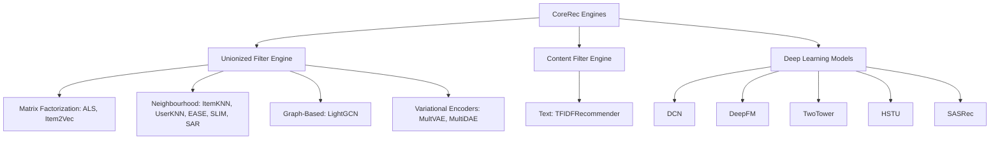
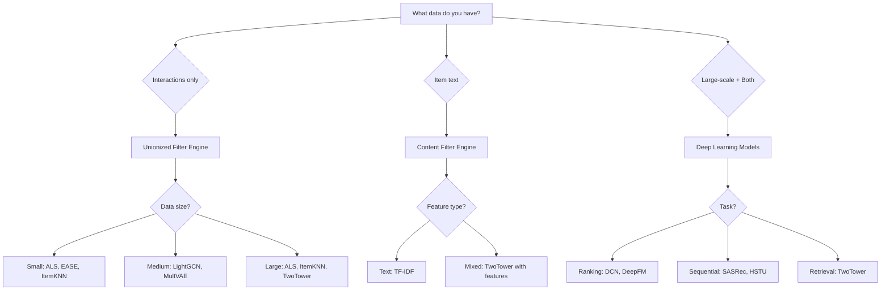

# Engines Overview

CoreRec provides three main recommendation engines, each containing state-of-the-art algorithms for different recommendation scenarios. In 0.7 every model is registered in `corerec.engines` and shares one API (`fit`, `recommend`, `predict`, `save`/`load`):

```python
import corerec.engines as engines

for family, models in engines.get_engine_info().items():
    print(family, sorted(models))   # e.g. classic ['ALS', 'EASE', ...]
```

## Engine Architecture


```mermaid
graph TB
    A[CoreRec Engines] --> B[Unionized Filter Engine]
    A --> C[Content Filter Engine]
    A --> D[Deep Learning Models]
    
    B --> B1[Matrix Factorization: ALS, Item2Vec]
    B --> B2[Neighbourhood: ItemKNN, UserKNN, EASE, SLIM, SAR]
    B --> B3[Graph-Based: LightGCN]
    B --> B7[Variational Encoders: MultVAE, MultiDAE]
    
    C --> C1[Text: TFIDFRecommender]
    
    D --> D1[DCN]
    D --> D2[DeepFM]
    D --> D3[TwoTower]
    D --> D4[HSTU]
    D --> D6[SASRec]
```

## Quick Comparison

| Engine | Best For | Algorithms | Data Required |
|--------|----------|------------|---------------|
| **Unionized Filter** | User-item interactions | 10 models | Interaction log |
| **Content Filter** | Item text | 1 model (TF-IDF) | Item descriptions |
| **Deep Learning** | Large-scale data | 5 models | Interactions (+ optional features) |

The 0.6 sandbox (about 50 more experimental models) was removed in 0.7.0.
To try an architecture that isn't here, write it as a PyTorch module and wrap
it in `corerec.nn.Recommender`.

All examples on this page use this toy data:

```python
import numpy as np

rng = np.random.default_rng(0)
user_ids = rng.integers(0, 200, 5000).tolist()
item_ids = rng.integers(0, 500, 5000).tolist()
ratings = [1.0] * len(user_ids)
```

## 1. Unionized Filter Engine

**Collaborative filtering and hybrid recommendation methods**

The Unionized Filter Engine specializes in collaborative filtering approaches that learn from user-item interactions.

### Categories

#### Matrix Factorization
Decompose user-item matrix into latent factors:

- **ALS** (Alternating Least Squares)
- **Item2Vec** (skip-gram embeddings over interaction sequences)

```python
from corerec.engines import ALS

model = ALS(factors=50, iterations=20)
model.fit(user_ids, item_ids, ratings)
recs = model.recommend(user_id=user_ids[0], top_k=10)
```

#### Neural Network Based
Deep learning for collaborative filtering:

- **DeepFM**, **DCN**, **TwoTower**: see [Deep Learning Models](#3-deep-learning-models)

NCF, AutoInt, AFM, DIN and DIEN were removed in 0.7.0. For a quick strong
baseline without a network, use the neighbourhood models:

```python
from corerec.engines import EASE

model = EASE(reg=250.0)
model.fit(user_ids, item_ids, ratings)
recs = model.recommend(user_id=user_ids[0], top_k=10)
```

#### Graph-Based
Leverage graph structure for recommendations:

- **LightGCN** (Light Graph Convolutional Network)

```python
from corerec.engines import LightGCN

model = LightGCN(n_factors=64, n_layers=3, epochs=20)
model.fit(user_ids, item_ids, ratings)
```

#### Attention Mechanisms
Attention-based recommendations:

- **SASRec** (Self-Attentive Sequential Recommendation)
- **HSTU** (generative next-item transducer)

```python
from corerec.engines import SASRec

model = SASRec(hidden_units=64, num_blocks=2, num_heads=1, epochs=2, verbose=False)
model.fit(user_ids, item_ids, ratings)   # events in time order
```

#### Bayesian Methods
Probabilistic approaches:

- **MultVAE** (multinomial variational autoencoder)

Bayesian MF was removed in 0.7.0.

#### Sequential Models
Time-aware recommendations:

- **SASRec**, **HSTU** (above)
- **SAR** with time decay (`timedecay_formula=True`)

Caser was removed in 0.7.0.

#### Variational Encoders
Generative models:

- **MultVAE**, **MultiDAE**

```python
from corerec.engines import MultVAE

model = MultVAE(hidden_dim=128, latent_dim=32, epochs=10)
model.fit(user_ids, item_ids)
recs = model.recommend(user_id=user_ids[0], top_k=10)
```

[**→ Collaborative models in detail**](collaborative/index.md)

---

## 2. Content Filter Engine

**Content-based and feature-rich recommendation methods**

The Content Filter Engine focuses on item and user features for recommendations.

### Categories

#### Traditional ML
Classical machine learning algorithms:

- **TF-IDF** (Term Frequency-Inverse Document Frequency)

```python
from corerec.engines import TFIDFRecommender

items = [1, 2, 3, 4]
docs = {1: "red running shoes", 2: "blue running shoes",
        3: "wireless earbuds", 4: "noise cancelling headphones"}

model = TFIDFRecommender()
model.fit(items, docs)
similar = model.recommend_by_text("running shoes", top_k=2)   # [1, 2] or [2, 1]
```

Decision trees, logistic regression and Vowpal Wabbit were removed in 0.7.0.

#### Neural Networks
Deep learning for content-based filtering:

DSSM, MIND, YouTube DNN and the CNN/RNN/autoencoder content models were
removed in 0.7.0. `TwoTower` covers the same retrieval setup and takes user
and item feature matrices (`fit(..., user_features=, item_features=)`).

#### Graph-Based
Graph neural networks for content: removed in 0.7.0.

#### Embedding Learning
Learn feature embeddings:

- **Item2Vec** learns item embeddings from interaction sequences (Word2Vec was removed in 0.7.0)

```python
from corerec.engines import Item2Vec

model = Item2Vec(factors=32, iterations=5)
model.fit(user_ids, item_ids)
recs = model.recommend(user_id=user_ids[0], top_k=10)
```

#### Hybrid & Ensemble
Combine multiple models: build a retrieval + ranking pipeline with
`corerec.pipelines` (see the pipeline tutorial).

#### Fairness & Explainability
Responsible AI for recommendations: removed in 0.7.0.

#### Learning Paradigms
Advanced learning techniques (transfer, meta, few- and zero-shot): removed in 0.7.0.


---

## 3. Deep Learning Models

**State-of-the-art deep learning architectures**

Production-ready implementations of cutting-edge deep learning models.

### Available Models

#### DCN (Deep & Cross Network)
Automatic feature crossing with deep networks:

```python
from corerec.engines import DCN

model = DCN(
    embedding_dim=16,
    num_cross_layers=3,
    deep_layers=[64, 32],
    epochs=2
)
model.fit(user_ids, item_ids, ratings)
```


#### DeepFM (Deep Factorization Machines)
Combines factorization machines with deep learning:

```python
from corerec.engines import DeepFM

model = DeepFM(
    embedding_dim=16,
    hidden_layers=[64, 32],
    epochs=2
)
model.fit(user_ids, item_ids, ratings)
```


#### GNNRec (Graph Neural Network Recommender)
Removed in 0.7.0: it didn't finish training on MovieLens-100K within an hour
on one core. Use `LightGCN` (above).


#### MIND (Multi-Interest Network)
Removed in 0.7.0. For sequence-aware retrieval use `SASRec` or `HSTU`.


#### NASRec (Neural Architecture Search)
Removed in 0.7.0.


#### SASRec (Self-Attentive Sequential)
Self-attention for sequential recommendations:

```python
from corerec.engines import SASRec

model = SASRec(
    hidden_units=64,
    num_blocks=2,
    num_heads=1,
    epochs=2,
    verbose=False
)
model.fit(user_ids, item_ids, ratings)
```

[**→ SASRec Documentation**](deep-learning/sasrec.md)

#### TwoTower and HSTU
Dual-encoder retrieval, and Meta's generative sequential model:

```python
from corerec.engines import HSTU, TwoTower

retriever = TwoTower(embedding_dim=32, epochs=2, verbose=False)
retriever.fit(user_ids, item_ids, ratings)

hstu = HSTU(embedding_dim=32, epochs=1)
hstu.fit(user_ids, item_ids)
```

---

## Choosing the Right Engine

### Decision Tree


```mermaid
graph TD
    A[What data do you have?] --> B{Interactions only}
    A --> C{Item text}
    A --> D{Large-scale + Both}
    
    B --> E[Unionized Filter Engine]
    C --> F[Content Filter Engine]
    D --> G[Deep Learning Models]
    
    E --> E1{Data size?}
    E1 --> E2[Small: ALS, EASE, ItemKNN]
    E1 --> E3[Medium: LightGCN, MultVAE]
    E1 --> E4[Large: ALS, ItemKNN, TwoTower]
    
    F --> F1{Feature type?}
    F1 --> F2[Text: TF-IDF]
    F1 --> F3[Mixed: TwoTower with features]
    
    G --> G1{Task?}
    G1 --> G2[Ranking: DCN, DeepFM]
    G1 --> G3[Sequential: SASRec, HSTU]
    G1 --> G4[Retrieval: TwoTower]
```

### Use Case Matrix

| Use Case | Recommended Engine | Best Model |
|----------|-------------------|------------|
| Movie Recommendations | Unionized Filter | EASE, SASRec |
| Product Recommendations | Deep Learning | DeepFM, DCN |
| News Articles | Content Filter | TF-IDF |
| Music Playlists | Deep Learning | SASRec, HSTU |
| Social Network | Unionized Filter | LightGCN |
| E-commerce | Deep Learning | TwoTower + DeepFM (retrieve, then rank) |
| Video Recommendations | Deep Learning | SASRec, HSTU |
| Books | Content Filter | TF-IDF |

## Performance Comparison

| Model | Training Speed | Inference Speed | Scalability |
|-------|---------------|-----------------|-------------|
| ALS | fast | fast | high |
| EASE / ItemKNN | fast | fast | high (EASE: dense items x items) |
| LightGCN | medium | fast | medium |
| DCN | medium | medium | high |
| DeepFM | medium | medium | high |
| TwoTower | medium | fast (embedding lookup) | high |
| SASRec / HSTU | slow | medium | medium |

Measured accuracy and timings on MovieLens are in `BENCHMARKS.md`.

## Next Steps

- Explore specific engine documentation:
  - [Deep Learning Models](deep-learning/index.md)
- Check out [Examples](../examples/index.md) for usage patterns
- See [Core Components](../core/index.md) for building blocks
