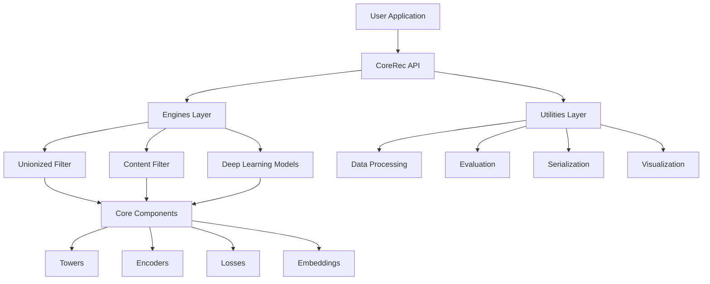
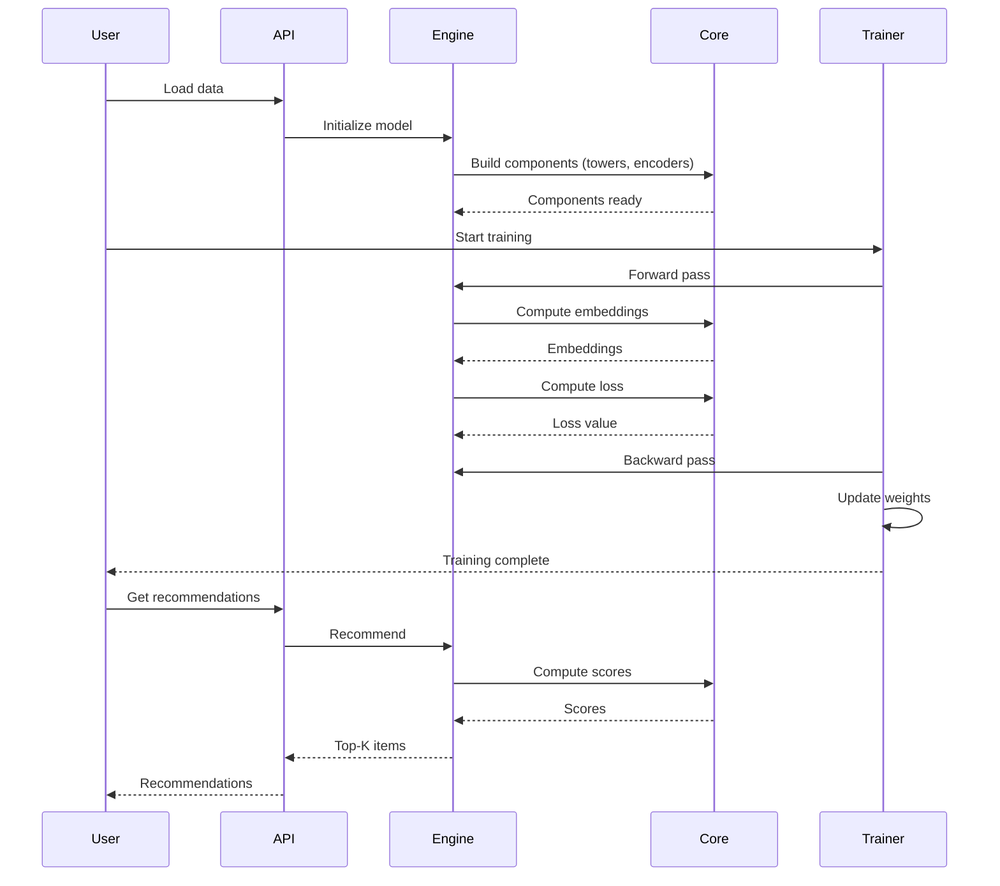

# Architecture Overview

CoreRec is built with a modular, extensible architecture that makes it easy to build, train, and deploy recommendation systems. This guide provides an overview of CoreRec's design principles and core components.

## Design Principles

CoreRec follows these key design principles:

1. **Modularity**: Components are independent and can be mixed and matched
2. **Extensibility**: Easy to add new algorithms and models
3. **Consistency**: Unified API across all recommendation engines
4. **Performance**: Optimized for speed and scalability
5. **Flexibility**: Support for both research and production use

## High-Level Architecture



## Core Architecture

### 1. Base Recommender Interface

All models in CoreRec inherit from `BaseRecommender`, ensuring a consistent API:

```python
from corerec.api.base_recommender import BaseRecommender

class BaseRecommender(ABC):
    """Unified base class for ALL recommendation models"""
    
    @abstractmethod
    def fit(self, data, **kwargs):
        """Train the model"""
        pass
    
    @abstractmethod
    def predict(self, user_id, item_id, **kwargs):
        """Predict score for user-item pair"""
        pass
    
    @abstractmethod
    def recommend(self, user_id, top_k=10, **kwargs):
        """Generate top-K recommendations"""
        pass
    
    @abstractmethod
    def save(self, path, format='pickle'):
        """Save model to disk"""
        pass
    
    @classmethod
    @abstractmethod
    def load(cls, path):
        """Load model from disk"""
        pass
```

This ensures that **all** models work the same way, regardless of their underlying algorithm.

### 2. Three-Engine Architecture

CoreRec organizes algorithms into three main engines:

```
┌─────────────────────────────────────────────────────┐
│                  CoreRec Framework                  │
├─────────────────────────────────────────────────────┤
│                                                     │
│  ┌──────────────────┐  ┌──────────────────┐       │
│  │ Unionized Filter │  │ Content Filter   │       │
│  │     Engine       │  │     Engine       │       │
│  ├──────────────────┤  ├──────────────────┤       │
│  │ • Matrix Fact.   │  │ • TF-IDF         │       │
│  │ • Neural Nets    │  │ • Neural Nets    │       │
│  │ • Graph-Based    │  │ • Embeddings     │       │
│  │ • Attention      │  │ • Hybrid         │       │
│  │ • Bayesian       │  │ • Fair/Explain   │       │
│  │ • Sequential     │  │ • Multi-Modal    │       │
│  └──────────────────┘  └──────────────────┘       │
│                                                     │
│  ┌──────────────────────────────────────────┐     │
│  │    Deep Learning Models Engine           │     │
│  ├──────────────────────────────────────────┤     │
│  │ DCN • DeepFM • GNNRec • MIND             │     │
│  │ NASRec • SASRec • Monolith               │     │
│  └──────────────────────────────────────────┘     │
│                                                     │
└─────────────────────────────────────────────────────┘
```

#### Unionized Filter Engine

Collaborative filtering and hybrid methods:

- **Matrix Factorization**: SVD, ALS, NMF, PMF, WNMF
- **Neural Networks**: NCF, DeepFM, AutoInt, DCN, AFM, DIN
- **Graph-Based**: LightGCN, DeepWalk, GNN, GeoimC
- **Attention Mechanisms**: SASRec, Transformers, A2SVD
- **Bayesian Methods**: BPR, Bayesian MF, VMF
- **Sequential Models**: LSTM, GRU, Caser, NextItNet
- **Variational Encoders**: VAE, CVAE, Beta-VAE

#### Content Filter Engine

Content-based filtering and feature-rich methods:

- **Traditional ML**: TF-IDF, SVM, Decision Trees, LightGBM, Logistic Regression
- **Neural Networks**: DSSM, MIND, TDM, YouTube DNN, CNN, RNN, Transformers
- **Graph-Based**: GNN, Semantic Models, Graph Filtering
- **Embedding Learning**: Word2Vec, Doc2Vec, Personalized Embeddings
- **Hybrid & Ensemble**: Attention Mechanisms, Ensemble Methods
- **Fairness & Explainability**: Fair Ranking, Explainable AI, Privacy-Preserving
- **Learning Paradigms**: Transfer Learning, Meta Learning, Few-shot, Zero-shot

#### Deep Learning Models

State-of-the-art deep learning architectures:

- **DCN** (Deep & Cross Network): Cross feature interactions
- **DeepFM**: Factorization machines + deep learning
- **GNNRec**: Graph neural networks for recommendations
- **MIND**: Multi-interest network with dynamic routing
- **NASRec**: Neural architecture search for RecSys
- **SASRec**: Self-attentive sequential recommendations

### 3. Core Components Layer

Reusable building blocks for all models:

#### Towers

Neural network modules that encode user/item features:

```python
from corerec.core.towers import MLPTower, UserTower, ItemTower

# User encoding tower
user_tower = UserTower(
    input_dim=100,
    output_dim=64,
    config={'hidden_dims': [128, 64], 'dropout': 0.2}
)

# Item encoding tower
item_tower = ItemTower(
    input_dim=200,
    output_dim=64,
    config={'hidden_dims': [256, 128, 64], 'activation': 'relu'}
)
```

Types of towers:
- **MLPTower**: Multi-layer perceptron
- **CNNTower**: Convolutional neural networks
- **TransformerTower**: Self-attention mechanism
- **FusionTower**: Multi-modal fusion

#### Encoders

Feature encoding and transformation:

```python
from corerec.core.encoders import (
    CategoricalEncoder,
    NumericalEncoder,
    SequenceEncoder,
    MultiModalEncoder
)
```

#### Embedding Tables

Efficient embedding storage and retrieval:

```python
from corerec.core.embedding_tables import EmbeddingTable

# Shared embedding table for users and items
embedding_table = EmbeddingTable(
    num_embeddings=10000,
    embedding_dim=64,
    sparse=True
)
```

#### Loss Functions

Multiple loss functions for different tasks:

```python
from corerec.core.losses import (
    BCELoss,           # Binary cross-entropy
    MSELoss,           # Mean squared error
    BPRLoss,           # Bayesian personalized ranking
    TripletLoss,       # Triplet loss for metric learning
    NCELoss,           # Noise contrastive estimation
    InfoNCELoss        # Contrastive learning
)
```

### 4. Training & Optimization Layer

Complete training pipeline:

```python
from corerec.trainer import Trainer
from corerec.training import TrainingConfig

# Configure training
config = TrainingConfig(
    epochs=20,
    batch_size=256,
    learning_rate=0.001,
    optimizer='adam',
    device='cuda'
)

# Create trainer
trainer = Trainer(model, config)

# Train with validation
trainer.fit(
    train_data,
    val_data=val_data,
    callbacks=[early_stopping, checkpoint]
)
```

Features:
- Distributed training (DDP, Horovod)
- Mixed precision training
- Gradient accumulation
- Learning rate scheduling
- Early stopping
- Model checkpointing

### 5. Data Processing Layer

Data loading and preprocessing:

```python
from corerec.data import DataLoader, DataProcessor
from corerec.preprocessing import FeatureEngineer

# Load data
loader = DataLoader()
data = loader.load_from_csv('interactions.csv')

# Process features
processor = DataProcessor()
processed = processor.process(data)

# Feature engineering
engineer = FeatureEngineer()
features = engineer.create_features(processed)
```

Features:
- Multiple data format support
- Feature engineering
- Data augmentation
- Negative sampling
- Batch processing

### 6. Evaluation & Metrics Layer

Comprehensive evaluation tools:

```python
from corerec.evaluation import Evaluator
from corerec.metrics import Metrics

evaluator = Evaluator(
    metrics=['precision@10', 'recall@10', 'ndcg@10', 'hit_rate@10']
)

results = evaluator.evaluate(model, test_data)
```

Available metrics:
- **Rating Prediction**: RMSE, MAE, MSE
- **Ranking**: Precision@K, Recall@K, NDCG@K, MAP@K
- **Classification**: AUC, Log Loss, Accuracy
- **Diversity**: Intra-list Similarity, Coverage
- **Business**: Click-Through Rate, Conversion Rate

### 7. Utilities Layer

Helper functions and tools:

```python
# Serialization
from corerec.serialization import ModelSerializer

# Visualization
from corerec.visualization import plot_metrics, plot_embeddings
import corerec.vish_graphs as vg

# Configuration
from corerec.config import ConfigManager

# Device management
from corerec.engines.unionizedFilterEngine.device_manager import DeviceManager
```

## Data Flow



## Extensibility

### Adding a New Model

To add a new recommendation model:

1. **Inherit from BaseRecommender**:

```python
from corerec.api.base_recommender import BaseRecommender

class MyNewModel(BaseRecommender):
    def __init__(self, **kwargs):
        super().__init__(name="MyNewModel")
        # Initialize your model
    
    def fit(self, data, **kwargs):
        # Training logic
        pass
    
    def predict(self, user_id, item_id, **kwargs):
        # Prediction logic
        pass
    
    def recommend(self, user_id, top_k=10, **kwargs):
        # Recommendation logic
        pass
    
    def save(self, path, format='pickle'):
        # Save logic
        pass
    
    @classmethod
    def load(cls, path):
        # Load logic
        pass
```

2. **Place in appropriate engine directory**:
   - Collaborative: `corerec/engines/unionizedFilterEngine/`
   - Content-based: `corerec/engines/contentFilterEngine/`
   - Deep learning: `corerec/engines/`

3. **Add tests**:
   - Unit tests in `tests/`
   - Integration tests
   - Smoke tests

### Adding a New Tower

```python
from corerec.core.towers import Tower

class MyCustomTower(Tower):
    def __init__(self, input_dim, output_dim, config):
        super().__init__('custom_tower', input_dim, output_dim, config)
    
    def _build_network(self):
        # Build your network
        pass
    
    def forward(self, x):
        # Forward pass
        pass
```

## Performance Optimization

CoreRec includes several optimization strategies:

### 1. Caching

```python
# Embedding caching
model.enable_embedding_cache()

# Prediction caching
model.enable_prediction_cache(max_size=10000)
```

### 2. Batch Processing

```python
# Batch predictions
scores = model.batch_predict([(u1, i1), (u2, i2), ...])

# Batch recommendations
recs = model.batch_recommend([u1, u2, u3], top_k=10)
```

### 3. GPU Acceleration

```python
# Use GPU
model = DCN(device='cuda')

# Multi-GPU
model = DCN(device='cuda', distributed=True)
```

### 4. Mixed Precision

```python
# Automatic mixed precision
model = DCN(mixed_precision=True)
```

## Next Steps

- Explore [Engines](../engines/index.md) for detailed algorithm documentation
- Learn about [Core Components](../core/index.md) for building custom models
- Check [Training & Optimization](../training/index.md) for advanced training techniques
- See [Examples](../examples/index.md) for real-world implementations


