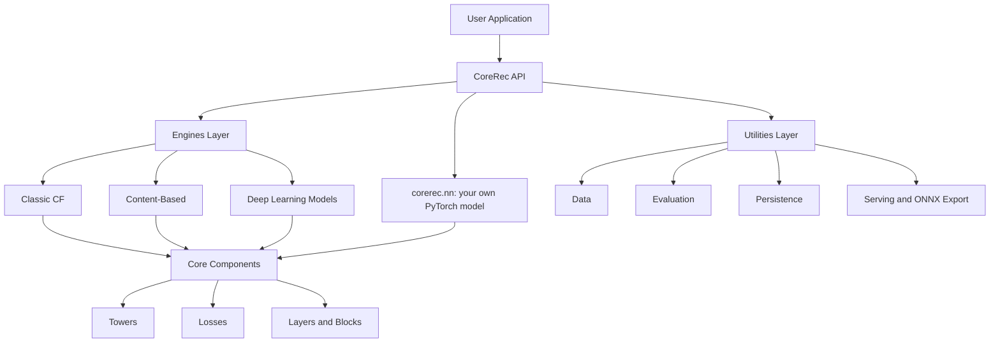
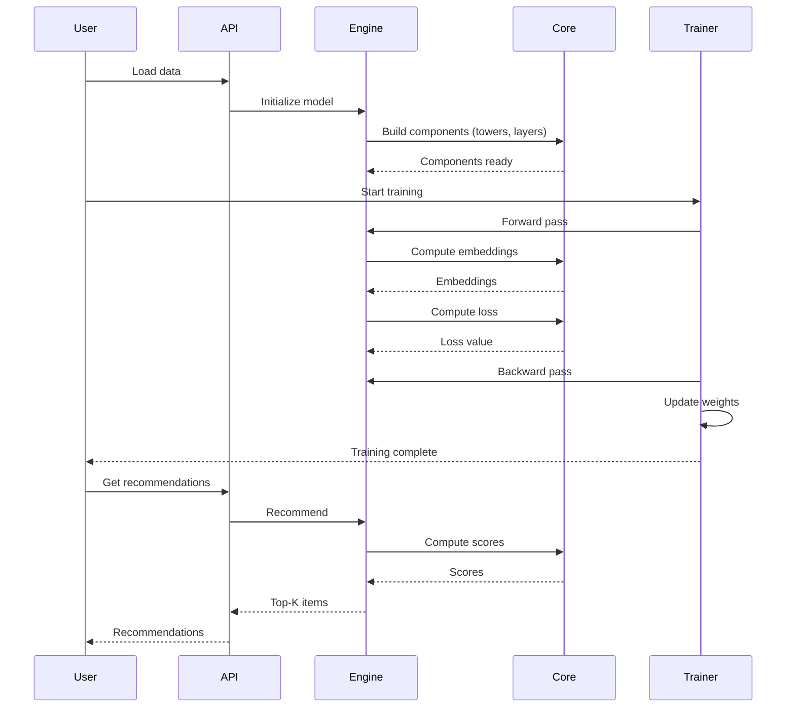

# Architecture Overview

CoreRec is built with a modular, extensible architecture that makes it easy to build, train, and deploy recommendation systems. This guide provides an overview of CoreRec's design principles and core components.

## Design Principles

CoreRec follows these key design principles:

1. **Modularity**: Components are independent and can be mixed and matched
2. **Extensibility**: Easy to add new algorithms and models
3. **Consistency**: Unified API across all recommendation engines
4. **Performance**: Optimized for speed and scalability
5. **Flexibility**: Support for both research and production use

## High-Level Architecture


```mermaid
graph TB
    A[User Application] --> B[CoreRec API]
    B --> C[Engines Layer]
    C --> D[Classic CF]
    C --> E[Content-Based]
    C --> F[Deep Learning Models]
    B --> NN[corerec.nn: your own PyTorch model]
    D --> G[Core Components]
    E --> G
    F --> G
    NN --> G
    G --> H[Towers]
    G --> J[Losses]
    G --> K[Layers and Blocks]
    B --> L[Utilities Layer]
    L --> M[Data]
    L --> N[Evaluation]
    L --> O[Persistence]
    L --> P[Serving and ONNX Export]
```

## Core Architecture

### 1. Base Recommender Interface

All models in CoreRec inherit from `BaseRecommender`, ensuring a consistent API.
These are the methods every model has (abridged from
`corerec/api/base_recommender.py`):

```python
from corerec.api.base_recommender import BaseRecommender

# class BaseRecommender(ABC):
#     def __init__(self, name=None, trainable=True, verbose=False): ...
#
#     @abstractmethod
#     def fit(self, *args, **kwargs) -> "BaseRecommender": ...
#     @abstractmethod
#     def predict(self, user_id, item_id, **kwargs) -> float: ...
#     @abstractmethod
#     def recommend(self, user_id, top_k=10, exclude_items=None, **kwargs) -> list: ...
#     @abstractmethod
#     def save(self, path, **kwargs) -> None: ...
#     @classmethod
#     @abstractmethod
#     def load(cls, path) -> "BaseRecommender": ...
#
#     # provided for you on top of the above
#     def batch_predict(self, pairs, **kwargs) -> list: ...
#     def batch_recommend(self, user_ids, top_k=10, **kwargs) -> dict: ...

print(sorted(BaseRecommender.__abstractmethods__))
# ['fit', 'load', 'predict', 'recommend', 'save']
```

This ensures that **all** models work the same way, regardless of their underlying algorithm.

### 2. Three-Engine Architecture

CoreRec groups its models into three families, all importable from
`corerec.engines`:

```
┌─────────────────────────────────────────────────────┐
│                  CoreRec Framework                  │
├─────────────────────────────────────────────────────┤
│                                                     │
│  ┌──────────────────┐  ┌──────────────────┐         │
│  │   Classic CF     │  │  Content-Based   │         │
│  ├──────────────────┤  ├──────────────────┤         │
│  │ • ALS            │  │ • TF-IDF         │         │
│  │ • SAR            │  │                  │         │
│  │ • ItemKNN        │  │                  │         │
│  │ • UserKNN        │  │                  │         │
│  │ • EASE, SLIM     │  │                  │         │
│  │ • Item2Vec       │  │                  │         │
│  └──────────────────┘  └──────────────────┘         │
│                                                     │
│  ┌──────────────────────────────────────────┐       │
│  │    Deep Learning Models (PyTorch)        │       │
│  ├──────────────────────────────────────────┤       │
│  │ TwoTower • DCN • DeepFM • LightGCN       │       │
│  │ SASRec • HSTU • MultVAE • MultiDAE       │       │
│  └──────────────────────────────────────────┘       │
│                                                     │
└─────────────────────────────────────────────────────┘
```

The registry is the source of truth:

```python
import corerec.engines as engines

print(engines.list_models())
# ['ALS', 'SAR', 'ItemKNN', 'UserKNN', 'EASE', 'SLIM', 'Item2Vec', 'TwoTower',
#  'LightGCN', 'DCN', 'DeepFM', 'SASRec', 'HSTU', 'MultVAE', 'MultiDAE',
#  'TFIDFRecommender']
```

#### Classic Collaborative Filtering

Fast, CPU-only models on the user-item matrix:

- **Matrix Factorization**: ALS (implicit feedback)
- **Item similarity**: SAR, ItemKNN
- **User similarity**: UserKNN
- **Linear autoencoders**: EASE (closed form), SLIM
- **Item embeddings**: Item2Vec

#### Content-Based

Recommends from item text rather than co-occurrence:

- **TFIDFRecommender**: TF-IDF over item descriptions

#### Deep Learning Models

PyTorch models (CUDA, Apple MPS or CPU):

- **TwoTower**: user and item towers for retrieval
- **DCN** (Deep & Cross Network): cross feature interactions
- **DeepFM**: factorization machines + deep learning
- **LightGCN**: graph convolution over the user-item graph
- **SASRec**: self-attentive sequential recommendation
- **HSTU**: generative sequential recommender
- **MultVAE / MultiDAE**: variational and denoising autoencoders

Anything not on this list can be written as a plain `nn.Module` and trained
with `corerec.nn.Recommender` (see [Adding a New Model](#adding-a-new-model)).

### 3. Core Components Layer

Reusable building blocks for all models:

#### Towers

Neural network modules that encode user/item features:

```python
import torch
from corerec.core.towers import MLPTower, UserTower, ItemTower

# User encoding tower
user_tower = UserTower(
    input_dim=100,
    output_dim=64,
    config={'hidden_dims': [128, 64], 'dropout': 0.2}
)

# Item encoding tower
item_tower = ItemTower(
    input_dim=200,
    output_dim=64,
    config={'hidden_dims': [256, 128, 64], 'activation': 'relu'}
)

print(user_tower(torch.randn(8, 100)).shape)  # torch.Size([8, 64])
```

Types of towers:
- **MLPTower**: Multi-layer perceptron (`hidden_dims`, `dropout`, `activation`, `norm`)
- **UserTower** / **ItemTower**: MLP towers named for their side
- **TowerFactory**: `TowerFactory.create_tower('mlp' | 'user' | 'item', ...)`

#### Encoders

Feature encoding for text and images (needs the optional `transformers`
extra: `pip install "corerec[transformers]"`):

```python
from corerec.embeddings import TextEncoder, MultimodalEncoder, PretrainedEmbeddings
```

#### Embedding Tables

There is no separate embedding-table class: models use `torch.nn.Embedding`
directly. The one convention to follow is that item index `0` is padding, so
item tables have `n_items + 1` rows:

```python
import torch.nn as nn

n_items, dim = 10000, 64
item_table = nn.Embedding(n_items + 1, dim, padding_idx=0)
```

`corerec.nn` also ships ready-made blocks (`SASRecBlock`, `HSTUBlock`,
`CrossLayer`, `FMInteraction`, `MLP`) built the same way.

#### Loss Functions

Multiple loss functions for different tasks:

```python
from corerec.core.losses import (
    DotProductLoss,    # pushes positive pairs' dot products up, negatives down
    CosineLoss,        # same, on cosine similarity
    InfoNCE,           # contrastive loss with in-batch negatives
)
from corerec.nn import (
    bpr_loss,              # Bayesian personalized ranking
    bce_loss,              # binary cross-entropy on positives vs negatives
    sampled_softmax_loss,  # softmax over sampled negatives
)
```

### 4. Training & Optimization Layer

Built-in models train themselves: `fit()` runs the loop, with
`epochs`, `batch_size`, `learning_rate` and `device` as constructor
arguments. For a raw `nn.Module` with your own data loader,
`corerec.training.Trainer` runs the loop with callbacks:

```python
import torch
import torch.nn as nn
from torch.utils.data import DataLoader, TensorDataset
from corerec.training import Trainer, EarlyStopping

# a toy regression model and data, standing in for your own
model = nn.Sequential(nn.Linear(16, 32), nn.ReLU(), nn.Linear(32, 1))
x, y = torch.randn(512, 16), torch.randn(512, 1)
train_loader = DataLoader(TensorDataset(x[:400], y[:400]), batch_size=64, shuffle=True)
val_loader = DataLoader(TensorDataset(x[400:], y[400:]), batch_size=64)

trainer = Trainer(
    model,
    optimizer=torch.optim.Adam(model.parameters(), lr=0.001),
    loss_fn=nn.MSELoss(),
    callbacks=[EarlyStopping(patience=3, monitor="val_loss")],
    device="cpu",
)

# Train with validation; batches are (inputs, targets)
trainer.train(train_loader, val_loader=val_loader, epochs=20)
```

Features:
- Early stopping (`EarlyStopping`)
- Model checkpointing (`ModelCheckpoint`)
- Learning rate scheduling (`LearningRateScheduler`)
- TensorBoard logging (`TensorBoardLogger`)
- Device selection: CUDA, Apple MPS or CPU

### 5. Data Processing Layer

Models take interactions as parallel lists or a pandas DataFrame, so loading
is ordinary pandas:

```python
import numpy as np
import pandas as pd
from corerec.engines import ALS

# stands in for pd.read_csv('interactions.csv')
rng = np.random.default_rng(0)
data = pd.DataFrame({
    'user_id': rng.integers(0, 50, 1000),
    'item_id': rng.integers(0, 200, 1000),
    'rating': 1.0,
})

model = ALS(factors=16, iterations=5)
model.fit(data['user_id'].tolist(), data['item_id'].tolist(), data['rating'].tolist())
print(model.recommend(int(data['user_id'][0]), top_k=5))
```

Features:
- Lists or DataFrames in; ids can be any hashable type
- Negative sampling inside each deep model's `fit()`
- Dataset classes in `corerec.data` (`RecommendationDataset`,
  `SequentialRecommendationDataset`, `StreamingDataset`, ...)
- Example datasets through `cr_learn` (`from cr_learn import ml_1m`)

### 6. Evaluation & Metrics Layer

Comprehensive evaluation tools:

```python
import numpy as np
from corerec.engines import ALS
from corerec.evaluation import evaluate

rng = np.random.default_rng(0)
events = list(zip(rng.integers(0, 30, 600).tolist(), rng.integers(0, 60, 600).tolist(), [1.0] * 600))
train, test = events[:480], events[480:]

model = ALS(factors=8).fit(*map(list, zip(*train)))

# ranking metrics through model.recommend(), training items excluded
results = evaluate(model, test, train_interactions=train, k=10)
print(results)
# {'NDCG@10': ..., 'MAP@10': ..., 'MRR@10': ..., 'Precision@10': ...,
#  'Recall@10': ..., 'HitRate@10': ..., 'n_users': 30, 'n_errors': 0}
```

`corerec.evaluation.Evaluator` does the same from a `{user: [relevant items]}`
dict and can compare several models.

Available metrics:
- **Ranking**: Precision@K, Recall@K, NDCG@K, MAP@K, MRR@K, HitRate@K (`RankingMetrics`)
- **Classification**: Accuracy, Precision, Recall (`ClassificationMetrics`)
- **Diversity**: Intra-list Diversity, Coverage, Gini coefficient (`DiversityMetrics`)
- **Online**: click-through and conversion from served traffic, via the
  feedback log in `corerec.serving`

### 7. Utilities Layer

Helper functions and tools:

```python
# Persistence: every model saves a safe bundle (npz + JSON, no pickle)
#   model.save("model_dir"); ALS.load("model_dir")
from corerec.serialization import save_to_file, load_from_file

# Serving: a FastAPI server around any fitted model
from corerec.serving import ModelServer

# ONNX export: TwoTower, DCN, DeepFM, SASRec, MultVAE, MultiDAE, corerec.nn models
from corerec.export import to_onnx

# Device management: 'auto' picks CUDA, then Apple MPS, then CPU
from corerec.device import resolve_device
print(resolve_device("auto"))
```

## Data Flow


```mermaid
sequenceDiagram
    participant User
    participant API
    participant Engine
    participant Core
    participant Trainer
    
    User->>API: Load data
    API->>Engine: Initialize model
    Engine->>Core: Build components (towers, layers)
    Core-->>Engine: Components ready
    User->>Trainer: Start training
    Trainer->>Engine: Forward pass
    Engine->>Core: Compute embeddings
    Core-->>Engine: Embeddings
    Engine->>Core: Compute loss
    Core-->>Engine: Loss value
    Trainer->>Engine: Backward pass
    Trainer->>Trainer: Update weights
    Trainer-->>User: Training complete
    User->>API: Get recommendations
    API->>Engine: Recommend
    Engine->>Core: Compute scores
    Core-->>Engine: Scores
    Engine-->>API: Top-K items
    API-->>User: Recommendations
```

## Extensibility

### Adding a New Model

To add a new recommendation model, the short path is to write the network as
a plain `nn.Module` and let `corerec.nn.Recommender` handle id mapping,
negative sampling, the training loop, devices and persistence. The full
contract is in the custom models guide (`docs/source/user_guide/custom_models.md`).

```python
import numpy as np
import torch.nn as nn
from corerec.nn import Recommender


class DotModel(nn.Module):
    def __init__(self, n_users, n_items, dim=32):
        super().__init__()
        self.users = nn.Embedding(n_users, dim)
        self.items = nn.Embedding(n_items + 1, dim, padding_idx=0)
        nn.init.normal_(self.users.weight, std=0.05)
        nn.init.normal_(self.items.weight, std=0.05)

    def forward(self, users, items):          # [B], [B, K] -> [B, K]
        return (self.users(users).unsqueeze(1) * self.items(items)).sum(-1)


rng = np.random.default_rng(0)
users = rng.integers(0, 100, 2000).tolist()
items = rng.integers(0, 300, 2000).tolist()

rec = Recommender(DotModel, {"dim": 32}, loss="bpr", epochs=3)
rec.fit(users, items)
print(rec.recommend(users[0], top_k=5))
```

To implement the whole interface yourself instead:

1. **Inherit from BaseRecommender**:

```python
from corerec.api.base_recommender import BaseRecommender

class MyNewModel(BaseRecommender):
    def __init__(self, **kwargs):
        super().__init__(name="MyNewModel")
        # Initialize your model
    
    def fit(self, user_ids, item_ids, ratings=None, **kwargs):
        # Training logic
        self.is_fitted = True
        return self
    
    def predict(self, user_id, item_id, **kwargs):
        # Prediction logic
        return 0.0
    
    def recommend(self, user_id, top_k=10, exclude_items=None, **kwargs):
        # Recommendation logic
        return []
    
    def save(self, path, **kwargs):
        # Save logic
        pass
    
    @classmethod
    def load(cls, path):
        # Load logic
        return cls()
```

2. **Place it in `corerec/engines/`** and add it to the `MODELS` registry in
   `corerec/engines/__init__.py` so `corerec.engines.list_models()` sees it.

3. **Add tests**:
   - Add it to `tests/test_model_contract.py` so it is held to the shared API
   - Production models also go in `tests/test_all_production_models.py`
     (fit, predict, recommend, save/load parity)

### Adding a New Tower

```python
import torch.nn as nn
from corerec.core.towers import Tower

class MyCustomTower(Tower):
    def __init__(self, input_dim, output_dim, config):
        super().__init__('custom_tower', input_dim, output_dim, config)
    
    def _build_network(self):
        # Build your network (called by Tower.__init__)
        self.network = nn.Linear(self.input_dim, self.output_dim)
    
    def forward(self, x):
        # Forward pass
        return self.network(x)
```

## Performance Optimization

CoreRec includes several optimization strategies:

### 1. Caching

There is no model-level cache switch. For serving, `corerec.serving.ModelServer`
and `BatchInferenceEngine` keep the fitted model in memory and score in
batches; precompute recommendations offline with `batch_recommend` when the
catalogue allows it.

### 2. Batch Processing

```python
import numpy as np
from corerec.engines import ALS

rng = np.random.default_rng(0)
users = rng.integers(0, 50, 1000).tolist()
items = rng.integers(0, 200, 1000).tolist()
model = ALS(factors=16).fit(users, items)

# Batch predictions
scores = model.batch_predict([(users[0], items[0]), (users[1], items[1])])

# Batch recommendations: {user_id: [items]}
recs = model.batch_recommend(users[:3], top_k=10)
```

### 3. GPU Acceleration

```python
from corerec.engines import DCN

# Use GPU
model = DCN(device='cuda')

# Or let CoreRec pick CUDA, then Apple MPS, then CPU
model = DCN(device='auto')
```

Multi-GPU training is not built in.

### 4. Mixed Precision

Not supported by the built-in models; they train in float32.

## Next Steps

- Explore [Engines](../engines/index.md) for detailed algorithm documentation
- Learn about [Core Components](../core/index.md) for building custom models
- See [Examples](../examples/index.md) for real-world implementations
