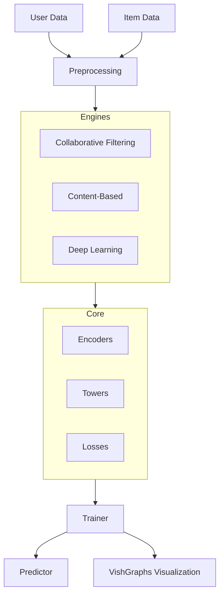

# CoreRec: Advanced Recommendation Systems Library

    
    
<em>State-of-the-Art Recommendation Engines for Researchers and Developers</em>

---

## 🚀 Why CoreRec?

**CoreRec** is designed to bridge the gap between academic research and production-ready recommendation systems. While many libraries offer *either* ease of use *or* flexibility, CoreRec offers both by providing:

1.  **Unified API**: Switch between Matrix Factorization, Graph Neural Networks, and Deep Learning models with a single line of code.
2.  **Visualization First**: Built-in integration with **VishGraphs** allows you to visualize 2D and 3D embeddings of your user-item graphs instantly.
3.  **Modular Architecture**: customizable **Towers** (MLP, transformer), **Encoders**, and **Loss Functions** let you build novel architectures without reinventing the wheel.

## 🏗️ Architecture

CoreRec follows a modular "Engine-based" architecture:

## 📦 Key Features

*   **Collaborative Filtering (Unionized)**: Proven algorithms like **ALS**, **LightGCN**, and **SVD** for robust baselines.
*   **Content-Based**: Leverage item metadata with **TF-IDF**, **Word2Vec**, and **Text Vectors**.
*   **Deep Learning (SOTA)**: Implementation of cutting-edge papers including **SASRec**, **MIND** (Multi-Interest), and **DCN** (Deep & Cross Network).
*   **Serving Ready**: Built-in model serving capabilities for real-time inference.

## 🤝 Philosophy

We believe in **"Glass-Box" machine learning**. You should be able to see *why* a recommendation was made. This is why we prioritize:
*   **Explainability**: Hooks to inspect attention weights.
*   **Visualization**: Tools to see the latent space.
*   **Type Safety**: Fully typed codebase for reliable development.

## 🔗 Next Steps

*   [**Quick Start**](getting-started/quickstart.md): Build your first recommender in 5 minutes.
*   [**User Guide**](user-guide/index.md): detailed walkthroughs of common tasks.
*   [**API Reference**](api/index.md): comprehensive documentation of every class and function.
